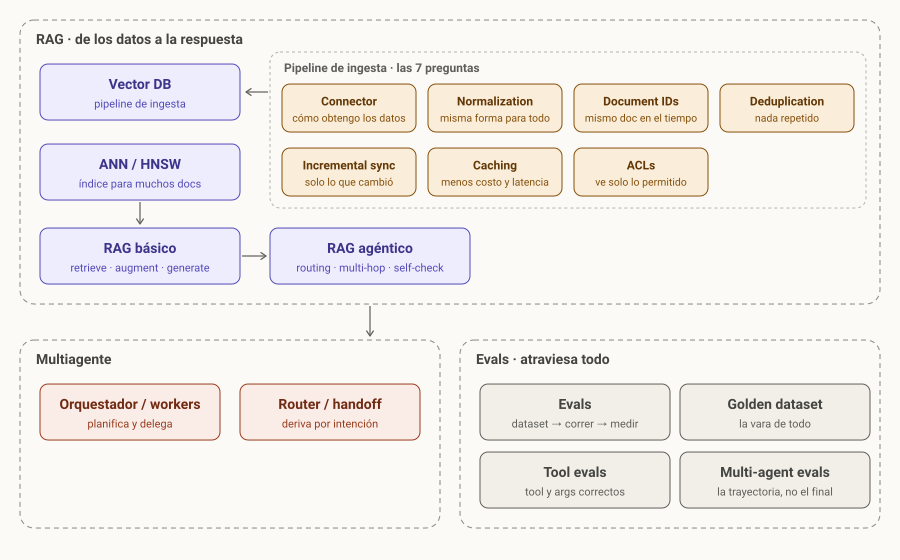

# AI Engineering · grafo de aprendizaje

Vault de Obsidian: cada archivo es un nodo, cada `[[wikilink]]` es una arista. Todo es markdown + Mermaid, así que se lee igual en Obsidian, en GitHub y en cualquier editor.



## Cómo usarlo
1. Obsidian → *Open folder as vault* → esta carpeta.
2. `Mapa.canvas` es la vista pipeline. La vista de grafo (Ctrl+G) ya viene coloreada por dominio.
3. Plugins recomendados (opcionales): **Dataview** (consultas sobre el frontmatter) y **Excalidraw** (diagramas a mano que se guardan como markdown).

## Estructura
| Carpeta | Dominio | Nodos |
|---|---|---|
| `retrieval/` | Cómo alimentar y consultar una Vector DB | Vector DB, ANN HNSW |
| `retrieval/ingesta/` | Las 7 preguntas del pipeline de ingesta | Connector, Normalization, Incremental sync, Document IDs, Deduplication, Caching, ACLs |
| `rag/` | Generación con retrieval | RAG, RAG agéntico |
| `multiagente/` | Coordinación entre agentes | Orquestador workers, Router handoff |
| `evals/` | Cómo saber si funciona | Evals, Golden dataset, Tool evals, Multi-agent evals |

## Anatomía de un nodo
Frontmatter con `tipo`, `dominio`, `estado` (`por-ver` → `aprendiendo` → `dominado`), `prereqs`, `se_evalua_con`, `contrasta_con`, `fuentes`. Después: una frase, un diagrama Mermaid, una tabla de cuándo sí / cuándo no, trade-offs. Plantilla en `templates/Nodo.md`.

## Tipos de arista
- `prereqs` → orden de estudio.
- `se_evalua_con` → conecta cada nodo con Evals.
- `contrasta_con` → pares que conviene entender juntos (RAG vs RAG agéntico, orquestador vs router).
- Wikilinks en el cuerpo → "se relaciona con".

## Qué estudiar ahora (Dataview)
```dataview
TABLE estado, prereqs FROM "" WHERE estado = "por-ver" SORT dominio
```
