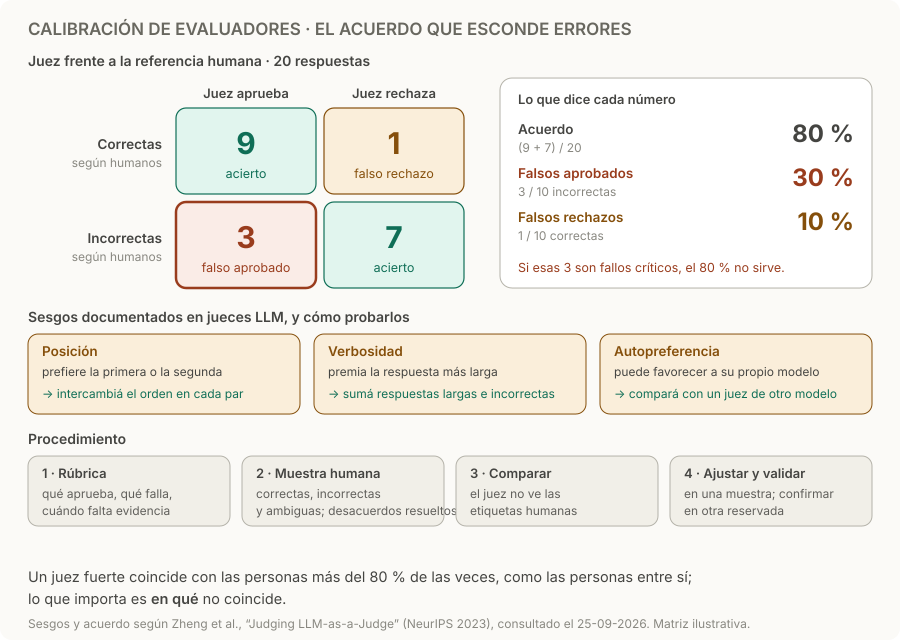

# Calibración de evaluadores

> **En una frase:** antes de confiar en el puntaje del juez, comprobá qué errores comete frente a una referencia humana.

## Un procedimiento corto
1. **Rúbrica:** definí qué aprueba, qué falla y cuándo falta evidencia. Usá código para montos, permisos y estados verificables.
2. **Muestra humana:** etiquetá casos correctos, incorrectos y ambiguos; resolvé desacuerdos entre revisores antes de fijar la referencia.
3. **Comparación:** aplicá el juez a los mismos casos, sin mostrarle las etiquetas humanas. Revisá falsos aprobados y falsos rechazados por tipo de tarea.
4. **Ajuste y validación:** mejorá la rúbrica con una muestra y comprobá el resultado en otra reservada. Versioná juez, prompt y referencias. [Diseño de evals](https://www.anthropic.com/engineering/demystifying-evals-for-ai-agents).

## Ejemplo ficticio
| Referencia humana | Juez aprueba | Juez rechaza |
|---|---:|---:|
| 10 respuestas correctas | 9 | 1 |
| 10 respuestas incorrectas | 3 | 7 |

El acuerdo es **16/20 = 80 %**, pero el juez aprueba **3/10 = 30 % de las incorrectas**. El promedio oculta un problema si esos fallos son críticos.

## Evitar engaños
- **Sesgos conocidos.** El estudio de Zheng et al. documenta sesgos de posición, de verbosidad y de autopreferencia, además de un razonamiento limitado. En comparaciones A/B, intercambiá el orden y ocultá el nombre del modelo; sumá respuestas largas pero incorrectas; y compará con un juez de otro modelo. [Estudio de jueces LLM](https://arxiv.org/abs/2306.05685).
- **El acuerdo no alcanza.** En ese estudio, un juez fuerte coincidió con las personas más del 80 % de las veces, lo mismo que las personas entre sí. Por eso importa en qué casos no coincide, no solo cuánto.
- Repetí casos para observar variabilidad; para comparar sistemas usá los mismos casos, reportá tamaño de muestra e incertidumbre. Una corrida no basta.
- Conservá “no evaluable” como categoría separada, con revisión humana.

> [!TIP] Para recordar
> **No preguntes cuánto coincide el juez: preguntá qué aprueba cuando no debería.**

## Practicá
> [!question]- ¿Aceptarías 95 % de acuerdo si todos los desacuerdos son filtraciones de datos?
> No. El acuerdo pesa igual todos los errores, y una filtración es un fallo crítico. Mirá de qué lado están: si el juez aprueba filtraciones que los humanos rechazaron, deja pasar justo lo que más importa. Reportá los errores por tipo y severidad, exigí cero falsos aprobados en esa categoría y verificá permisos y datos de cliente con código, sin depender del juez. Es el mismo problema del ejemplo: 80 % de acuerdo escondía 30 % de incorrectas aprobadas.

> [!question]- En comparaciones A/B, tu juez elige más seguido la respuesta que aparece primero. ¿Cómo lo medís y lo corregís?
> Corré cada par dos veces, una en cada orden. Si el veredicto cambia al invertirlo, es sesgo de posición: contá ese caso como inconsistente o empate, no como victoria, y reportá qué porcentaje de veredictos cambia. Para decidir, evaluá siempre en los dos órdenes, o pasá a puntajes absolutos con rúbrica en lugar de comparaciones.

> [!question]- Usás el mismo modelo como agente y como juez. ¿Qué riesgo corrés y cómo lo comprobás?
> Autopreferencia: el juez puede favorecer respuestas con el estilo de su propio modelo. Comprobalo con la muestra humana: compará los falsos aprobados en respuestas del agente con los de respuestas de otra fuente, y corré un juez de otro modelo sobre los mismos casos. Si difieren, cambiá de juez o pasá a código los criterios verificables: [[Graders]].

## Se conecta con
[[Graders]] · [[Golden dataset]] · [[Regresiones y CI]] · [[Caso práctico - Asistente de soporte]]
