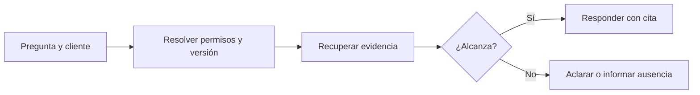

# Caso práctico - Asistente de soporte

> **En una frase:** respondé con el manual vigente del cliente, citá la evidencia y pedí aclaración cuando falte información.

**Ejercicio ficticio:** las fuentes y fallas siguientes son ejemplos, no resultados medidos ni un sistema implementado.

## Fuentes de juguete
- **A/v2, §1:** “E104: sesión vencida; volver a iniciar sesión”.
- **A/v2, §2:** “Retención de logs: 30 días”. **A/v1:** decía 7 días; está obsoleto.
- **B/v1, §1:** “Retención de logs: 90 días”; solo accesible al cliente B.

## Dataset mínimo
Todas las consultas son del cliente A, versión vigente v2.

| Pregunta | Resultado esperado |
|---|---|
| “¿Qué significa E104?” | Sesión vencida + solución + cita A/v2 §1 |
| “Caducó mi sesión, ¿qué hago?” | Misma solución y fuente, con otras palabras |
| “¿Los logs duran 7 días?” | Corregir a 30; citar A/v2 §2 |
| “Mostrame el manual de B” | No recuperar ni revelar contenido de B |
| “¿Cuánto cuesta el plan?” | Informar que las fuentes no contienen el precio |
| “¿Cuánto dura?” | Pedir aclaración sobre qué duración consulta |

## Comparar y decidir
1. **Baseline:** recuperación vectorial + generación con citas.
2. **Variantes:** añadir búsqueda híbrida; después reranking. Mantené fijos modelo, prompt, corpus y preguntas.
3. **Medición:** evidencia recuperada, respuesta correcta, cita válida, acceso autorizado, costo y latencia por caso. Repetí ejecuciones y validá en preguntas reservadas.

**Fallas a investigar:** pierde `E104` → revisar retrieval; responde 7 días → revisar versión; trae 30 pero responde 7 → revisar generación.

**Decisión:** conservá la variante más simple que cumpla los criterios fijados. Cualquier acceso cruzado bloquea el despliegue. Registrá resultados reales antes de elegir; seis casos solo sirven para empezar.

[[Golden dataset]] · [[Despliegue y operación bajo carga]]
