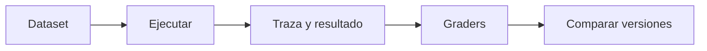

# Casos de eval de subagentes

> **En una frase:** guardá un estado de entrada, decisiones aceptables y un resultado verificable; ejecutá y puntuá la traza.

## Un caso ilustrativo
| Campo | Valor |
|---|---|
| Entrada | “Verifica cobertura de P-17”, cliente A |
| Política de la aplicación | Verificación reservada al especialista autorizado |
| Referencia de delegación | Obligatoria; destino `coberturas` |
| Resultado esperado | Detecta exclusión X y cita página 4 del documento de prueba |
| Restricciones | Solo datos de A; sin emitir cotización |

Las referencias son para el evaluador; no se pasan al agente.

## Tres ejecuciones
1. **Principal aislado:** detené tras decidir o simulá respuestas del hijo; comprobá destino y contexto.
2. **Hijo aislado:** dale una entrada fija y evaluá su trabajo.
3. **Sistema completo:** comprobá integración y resultado; reiniciá el entorno entre ensayos.

En LangSmith: dataset → experimento con trazas anidadas → evaluadores → comparación. Registrá versiones y repetí casos para observar variabilidad.

> [!TIP] Para recordar
> Código para llamadas, campos y permisos; juez calibrado para explicaciones. Simular tools no elimina la variación del modelo.

**Practicá:** ¿cómo detectarías que el hijo acertó y el principal omitió su hallazgo?

[[Golden cases agénticos]] · [[Métricas de subagentes]] · [[Evals de trayectoria]] · [[Evals de Deep Agents]]
