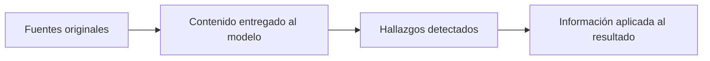

# Cobertura y uso de información

> **En una frase:** medí si la respuesta aplica los hechos y restricciones relevantes, aunque lleguen por mensajes, archivos completos o grep.

## Qué medir
Curá hechos y restricciones esperados, con fuente, versión, página o pasaje y criticidad.

| Métrica | Cálculo |
|---|---|
| Recall de hallazgos | Esperados correctamente reflejados / esperados |
| Precisión | Hallazgos emitidos correctos / emitidos |
| Respaldo | Afirmaciones respaldadas por sus fuentes / verificadas |
| Uso de restricciones | Restricciones aplicables cumplidas / aplicables |
| Omisión crítica | Casos con alguna omisión crítica / casos con hallazgos críticos |

Compará hechos equivalentes, sin contar repeticiones. Denominador cero: “no aplica”; no equivale a éxito.

**Ejemplo:** el usuario pide usar EUR y un endoso cambia el límite. Citar ambos documentos pero responder con USD y el límite antiguo falla el uso de información.

> [!TIP] Para recordar
> Páginas entregadas / páginas requeridas mide cobertura técnica, no comprensión. Comprobá también OCR, tablas y truncamiento. Un grep sin coincidencias no demuestra ausencia.

Código verifica campos y reglas explícitas; un juez calibrado compara significado con la referencia y evidencia. Ninguno descubre automáticamente todas las omisiones de una referencia incompleta.

**Practicá:** ¿el dato nunca llegó, fue ignorado o se perdió al resumir?

[[Lost in the middle]] · [[Evals de trayectoria]] · [[Seguridad y evidencia documental]]
