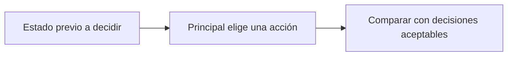

# Decisión de delegar

> **En una frase:** definí cuándo delegar es obligatorio, opcional o no corresponde, antes de puntuar la llamada.

## Tres casos
Ejemplos de una política de prueba, no reglas universales:

| Etiqueta | Caso | Qué aceptar |
|---|---|---|
| Obligatorio | Solo el especialista autorizado puede verificar cobertura | Invocarlo con los datos necesarios |
| No corresponde | Falta identificar la póliza | Pedir aclaración antes de delegar |
| Opcional | Ambos agentes pueden resolver la consulta | Cualquiera de los caminos si cumple calidad y presupuesto |

Evaluá con la información disponible **en ese momento**, no con hallazgos posteriores. Revisá destino, argumentos y permisos.

**Métricas:** omisiones / casos obligatorios; delegaciones indebidas / casos donde no corresponde. Si no hay casos de una categoría, reportá “no aplica”.

> [!TIP] Para recordar
> Una llamada opcional no es innecesaria por definición. Compará calidad, costo y latencia con y sin delegación.

## Practicá
> [!question]- ¿Permitirías dos especialistas distintos si ambos pueden resolver correctamente la tarea?
> Sí, si la política no exige uno en particular: es un caso opcional y la referencia debe aceptar los dos destinos. Exigir uno solo castigaría un camino válido. En cada camino comprobás lo mismo: que el especialista tenga permisos para esos datos, que reciba el contexto necesario y que calidad, costo y latencia queden dentro del presupuesto. Si uno cuesta mucho más con la misma calidad, eso aparece en las métricas de costo, no como un error de delegación.

## Se conecta con
[[Métricas de subagentes]] · [[Casos de eval de subagentes]] · [[Tool evals]] · [[Regresiones y CI]]
