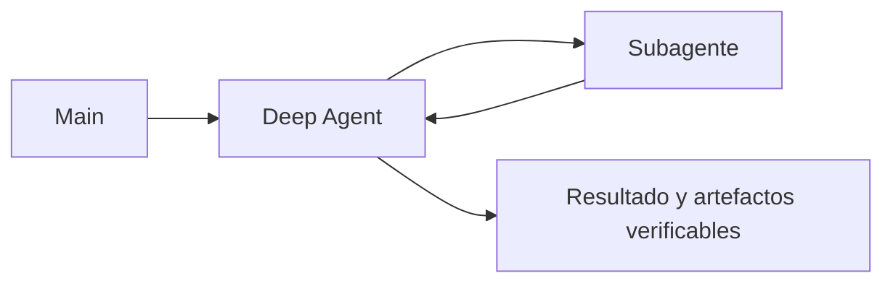

# Evals de Deep Agents

> **En una frase:** aplicá las mismas evals de delegación y añadí pruebas sobre archivos, contexto y recuperación que tu aplicación utilice.

## Tres grupos de pruebas
| Grupo | Caso y comprobación |
|---|---|
| Resultado | El informe existe, contiene los campos pedidos y sus citas respaldan los valores |
| Contexto | Tras compactar o descargar contenido, conserva una restricción crítica y recupera su evidencia |
| Recuperación | Un hijo falla o se cancela: no inventa éxito, respeta límites y evita duplicar acciones |

**Traza:** conectá main → Deep Agent → hijos. Medí las decisiones en cada nivel y el costo de todas las llamadas al modelo, sin volver a sumar totales agregados. La latencia es tiempo real transcurrido; no la suma de ramas paralelas.

> [!TIP] Para recordar
> Reiniciá archivos, memoria y estado por ensayo. Si probás continuidad, declarala como parte del caso. Un plan marcado “completo” no demuestra éxito.

**Practicá:** ¿la compactación perdió una exclusión que estaba al comienzo del documento?

[[Lost in the middle]] · [[Cobertura y uso de información]] · [[Presupuesto de contexto]] · [[Ejecución y recuperación]] · [[Trazas y debugging]]
