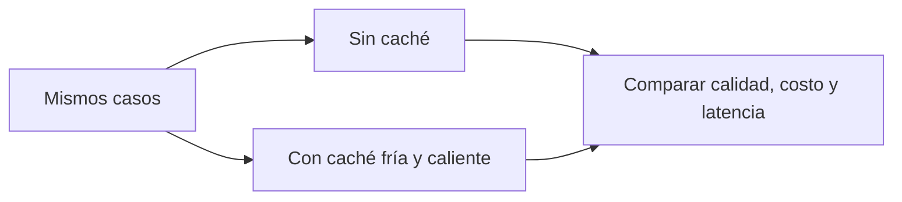

# Evals de caché

> **En una frase:** medí cuánto ahorra y cuántas veces reutiliza algo que ya no corresponde.

## Métricas de respuestas y tools
| Métrica | Cálculo |
|---|---|
| Hit rate | Hits / consultas de caché |
| Reutilización incorrecta | Hits cuya reutilización es inválida / hits evaluados |
| Respuestas obsoletas | Respuestas servidas con datos vencidos / respuestas evaluadas |
| Ahorro neto | Costo sin caché − costo con caché, incluyendo infraestructura y validación |

Reportá además éxito de tarea, latencia p95 y violaciones de permisos. Denominador cero → N/A. Para [[Prompt caching]], medí tokens de entrada cacheados / tokens de entrada y facturación real.

## Golden cases mínimos
- Misma pregunta, mismo contexto: reutilización válida.
- Nuevo endoso o mensaje correctivo: descartar respuesta anterior.
- Otro cliente o permiso revocado: no entregar contenido inaccesible.
- Preguntas similares con negación, moneda o fecha distinta: rechazar falso hit semántico.
- TTL vencido o caché caída: recalcular sin perder corrección.

**Cómo juzgar:** código para versiones, permisos, valores y expiración; referencia curada o juez calibrado para equivalencia semántica. No siempre hace falta un LLM.

**Para medir cambios del agente**, desactivá el caché de respuestas o aislalo por versión: devolver salidas viejas escondería regresiones. Para evaluar el producto, probá también caché activada, tráfico representativo y concurrencia.

## Practicá
> [!question]- ¿Por qué subir el hit rate puede empeorar el sistema?
> Porque el hit rate cuenta reutilizaciones, no reutilizaciones correctas. Bajar el umbral semántico o quitar dependencias de la clave sube los hits, y también sirve respuestas de otro contexto: la de “¿cubre inundaciones?” para “¿excluye inundaciones?”, una cotización anterior al endoso o datos de otro cliente. Mirá el hit rate junto con la reutilización incorrecta, las respuestas obsoletas, las violaciones de permisos y el éxito de la tarea. Muchos hits con algunas reutilizaciones inválidas pueden ser peores que menos hits sin ninguna.
