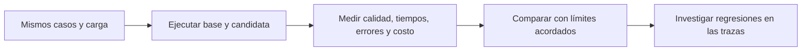

# Evals de rendimiento

> **En una frase:** comprobá que el sistema responde dentro del tiempo y costo aceptables, con calidad suficiente y bajo la carga esperada.

## Qué medir
| Métrica | Qué te dice |
|---|---|
| **Latencia total p50 y p95** | Espera típica y espera en la zona lenta; p99 si hay suficientes mediciones |
| **TTFT p95**, si hay streaming | Cuánto tarda en empezar la salida; comprobá también el primer texto visible |
| **Errores y timeouts** | Peticiones fallidas / peticiones iniciadas; registrá cancelaciones y rechazos por separado |
| **Throughput** | Tareas completadas por segundo; reportá también cuántas llegan y cuántas quedan pendientes |
| **Costo por tarea resuelta** | Costo total de la corrida, incluidos intentos fallidos / tareas resueltas |
| **Éxito de tarea** | Tareas que cumplen los criterios / tareas evaluadas; responder rápido no demuestra corrección |

Denominador cero → N/A. Los tiempos se miden según [[Latencia y percentiles]]. Mirá latencia junto con tráfico, errores y saturación: la cola puede crecer aunque las llamadas al modelo sigan igual. [Señales de Google SRE](https://sre.google/sre-book/monitoring-distributed-systems/).

## Casos mínimos
| Escenario | Qué comprobar |
|---|---|
| Consulta simple y tarea con varias tools | Tiempos por tipo de tarea, sin esconder las complejas en el promedio |
| Contexto corto y largo; respuesta corta y larga | Impacto de tokens de entrada y salida, además de la calidad |
| Caché fría, caliente y caída | Que el ahorro no dependa de devolver una respuesta inválida: [[Evals de caché]] |
| Carga normal, pico y carga sostenida | p95, tareas completadas, cola, rechazos y recuperación: [[Despliegue y operación bajo carga]] |
| Tool lenta, timeout y reintento | Presupuesto total de tiempo, estado correcto y ninguna acción duplicada: [[Tool evals]] |
| Streaming interrumpido o cancelado | Salida parcial identificada y trabajo detenido cuando sea posible: [[Streaming y cancelación]] |

## Cómo comparar
1. **Fijá antes los límites y la población.** Ejemplo ilustrativo: consultas simples con caché fría, 5 peticiones/s durante 10 min; p95 total ≤ 5 s, errores ≤ 1 % y calidad sin caída fuera de tolerancia. No hay un límite universal.
2. **Usá condiciones equivalentes.** Mismos casos, entorno, carga, longitudes y política de caché. Versioná modelo, prompt, tools e índice; alterná base y candidata y repetí para detectar variación del proveedor.
3. **Registrá por petición.** Caso, versión, tiempos, resultado, errores, tokens y costo. Calculá percentiles de cada grupo; medí las llamadas reales para rendimiento. Los mocks sirven para probar lógica, pero no demuestran la velocidad de producción.
4. **Aplicá todos los criterios.** Menor p95 con más fallos, respuestas incompletas o peor calidad no alcanza. Los límites pueden formar un gate automático. [Umbrales de k6](https://grafana.com/docs/k6/latest/using-k6/thresholds/).

**Ejemplo ilustrativo:** la base tiene p95 de 4,2 s y la candidata 6,1 s bajo las mismas condiciones. Aunque mantenga calidad y baje el costo, no cumple el límite de 5 s. Confirmá con repeticiones e investigá las ejecuciones lentas en [[Trazas y debugging]].

## Se conecta con
[[RAG evals]] · [[Tool evals]] · [[Métricas de subagentes]]. Los resultados alimentan [[Regresiones y CI]] antes de publicar y [[Evals por cliente y producción]] durante el uso real.
