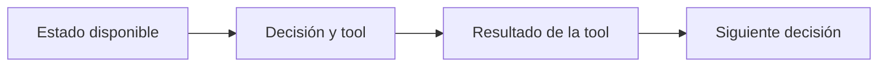

# Evals de trayectoria

> **En una frase:** evaluá decisiones observables durante la ejecución, además del resultado final.

## Tres clases de checks
| Check | Ejemplo | Cómo |
|---|---|---|
| Acción y argumentos | Guarda para el cliente correcto | Código sobre llamada y resultado |
| Orden parcial | Lee el endoso antes de persistir el valor actualizado | Código sobre eventos |
| Uso de información | Aplica una excepción sin perder su condición | Regla explícita o juez con evidencia |

**Métricas:** checks aprobados / aplicables; casos sin violaciones críticas / casos. Mostrá ambos: muchos aciertos no compensan una acción prohibida.

## Dos formas de ejecutar
- **Paso aislado:** reconstruí un estado válido y evaluá la próxima decisión. Ayuda a localizar el error.
- **End-to-end:** dejá que el agente produzca su recorrido real. Detecta errores acumulados.

> [!TIP] Para recordar
> En AgentEvals, `strict` exige orden, `unordered` permite reordenar, `superset` admite llamadas extra y `subset` restringe a las de referencia. Ninguno verifica por sí solo todo el resultado de negocio; agregá tus checks.

Evaluá con lo conocido en ese paso, sin exigir un único recorrido ni acceder a razonamiento interno. Que una tool haya sido llamada no prueba que tuvo éxito.

**Practicá:** ¿grep era obligatorio o una lectura directa también resolvía correctamente?

[[Tool evals]] · [[Métricas de subagentes]]
