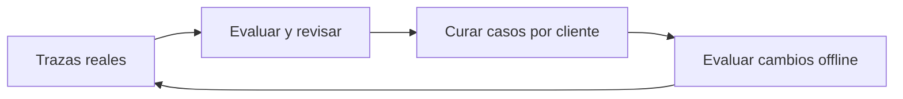

# Evals por cliente y producción

> **En una frase:** comprobá qué cambia para cada cliente y usá fallas reales para mejorar tus pruebas.

## Tres ideas
- **Por cliente:** combiná una suite común con casos de sus documentos, reglas e idiomas. Separá permisos y datos; reportá resultados por grupo.
- **Offline:** compará versiones con referencias curadas. Medí éxito de tarea, costo por tarea resuelta y latencia.
- **Online:** muestreá trazas y correcciones humanas. Sin una referencia, una señal automática de calidad no prueba que la respuesta sea correcta.

**Ejemplo:** mejora el promedio, pero empeora la extracción de moneda para un cliente. Su conjunto de evals hace visible la regresión.

> [!TIP] Para recordar
> En LangSmith: dataset → experimento → comparación; trazas → evaluación online → revisión → nuevos casos. Versioná también los criterios.

**Practicá:** ¿cómo elegirías qué trazas revisar sin mirar solo los errores reportados?

[[Regresiones y CI]] · [[Trazas y debugging]] · [[Seguridad y evidencia documental]]
