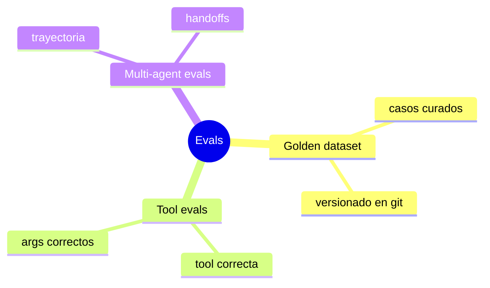
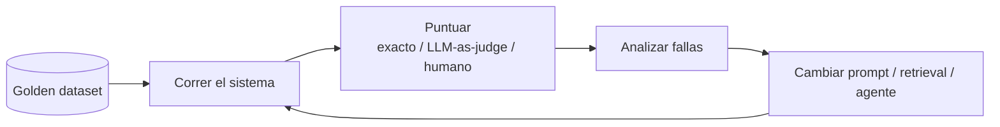
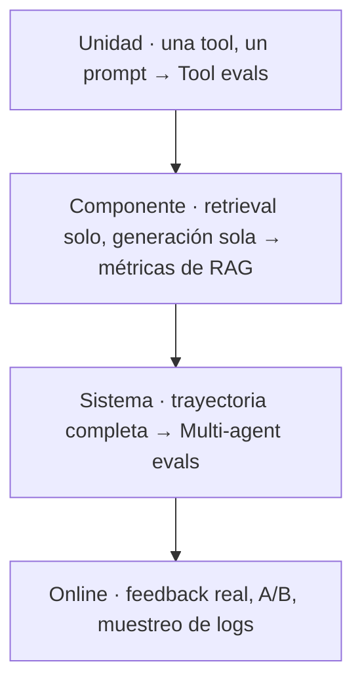

# Evals

> **En una frase:** sin evals no sabés si el cambio que hiciste mejoró o rompió algo. Es el test suite de un sistema no determinístico.

## Mapa


## Diagrama


## Niveles


## Métricas que aparecen todo el tiempo
| Qué medís | Métrica | Cómo |
|---|---|---|
| ¿Trajo lo correcto? | Recall@k, context precision | Comparar chunks con los esperados |
| ¿Respondió con lo que trajo? | Faithfulness | LLM-as-judge con las fuentes a la vista |
| ¿Respondió lo que se preguntó? | Answer relevance | LLM-as-judge o similitud |
| ¿Usó bien las tools? | Tool accuracy | [[Tool evals]] |
| ¿Llegó por un camino razonable? | Trajectory score | [[Multi-agent evals]] |

## Reglas
- El dataset es lo primero: [[Golden dataset]].
- LLM-as-judge necesita su propia eval: ¿el juez coincide con humanos?
- Corré los evals en CI. Un cambio de prompt es un deploy.

## Estado de los nodos
```dataview
TABLE WITHOUT ID file.link AS nodo, estado
FROM "evals" WHERE tipo != "mapa" SORT file.name
```

[[Evals.canvas|Abrir el canvas de Evals]] · para ver solo este subgrafo: clic derecho en esta nota → *Open local graph*.
