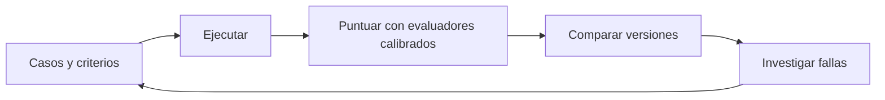

# Evals

> **En una frase:** definir qué cuenta como éxito, medirlo y convertir las fallas en nuevas pruebas.



## Orden de lectura
| Bloque | Notas |
|---|---|
| **1. Casos y criterios** | [[Golden dataset]], [[Golden cases agénticos]], [[Graders]], [[Calibración de evaluadores]] |
| **2. Qué evaluar** | [[RAG evals]], [[Tool evals]], [[Evals de caché]], [[Evals de trayectoria]], [[Cobertura y uso de información]], [[Lost in the middle]] |
| **3. Coordinación** | [[Multi-agent evals]] → [[Evaluación de subagentes]] → [[Decisión de delegar]] → [[Métricas de subagentes]] → [[Casos de eval de subagentes]] → [[Evals de Deep Agents]] |
| **4. Decidir y monitorear** | [[Regresiones y CI]] → [[Evals por cliente y producción]] |
| **5. Practicar** | [[Caso práctico - Asistente de soporte]] |

Las evals de RAG, tools y caché son pruebas complementarias; no hace falta ejecutar una para entender la siguiente. La coordinación es una especialización para sistemas que delegan.

## Qué mide cada capa
- **Recuperación:** recall, precisión y ranking de evidencia.
- **Respuesta:** corrección, relevancia y respaldo en fuentes.
- **Acciones y coordinación:** tools, argumentos, permisos y estado final.
- **Sistema:** éxito de tarea, costo y latencia, también por cliente.

## De las pruebas al uso real
[[Operación en producción]] y [[Despliegue y operación bajo carga]] viven en Runtime. Sus incidentes aportan casos al [[Golden dataset]]; las mediciones de calidad permanecen en esta categoría.

## Estado de los nodos
```dataview
TABLE WITHOUT ID file.link AS nodo, bloque, estado
FROM "evals" WHERE tipo != "mapa" SORT orden
```

[[Evals.canvas|Abrir el canvas de Evals]]
