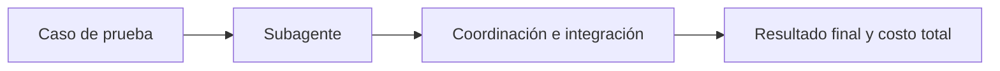

# Evaluación de subagentes

> **En una frase:** evaluá cada subagente, la coordinación y el resultado completo; compará también contra un solo agente.

## Cuatro preguntas
| Nivel | Qué comprobar |
|---|---|
| Decisión | Si correspondía delegar, a quién y con qué contexto |
| Subagente | Cumple su tarea con el contexto recibido y aporta evidencia |
| Coordinación | Delegación útil, sin duplicados ni pérdida de información al integrar |
| Sistema | Éxito final, permisos, costo total y latencia |

**Ejemplo:** el subagente detecta una exclusión, pero el principal la omite. La extracción funciona; la integración falla.

> [!TIP] Para recordar
> Probá timeouts, cancelación y resultados contradictorios. Repetí casos y aceptá caminos distintos si cumplen las restricciones.

**Practicá:** ¿mejora el resultado frente a un agente con presupuesto comparable? Retirá un subagente y medí qué aporte desaparece.

## Cómo probarlo
[[Decisión de delegar]] → [[Métricas de subagentes]] → [[Casos de eval de subagentes]] → [[Evals de Deep Agents]].

[[Multi-agent evals]] · [[Golden dataset]] · [[Regresiones y CI]] · [[Trazas y debugging]]
