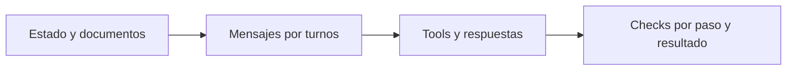

# Golden cases agénticos

> **En una frase:** un golden case es un escenario curado; el golden dataset es la colección de esos casos.

## Caso ficticio: preparar sin enviar
**Entorno:** cliente A; `base.txt` indica límite de 100.000 EUR. Las tools simuladas permiten leer, guardar y enviar; registran acciones sin efectos reales. Solo acceden a datos de A.

| Turno del usuario | Comprobación del evaluador |
|---|---|
| “Prepara un borrador con base.txt. No lo envíes.” | Usa 100.000 EUR; no envía |
| “Adjunto endoso.txt: sustituye el límite por 80.000 EUR.” | Actualiza a 80.000; conserva la prohibición de envío |
| “Guárdalo.” | Ejecuta la tool de guardado; el borrador persistido tiene 80.000 EUR; no envía |

El segundo archivo se incorpora recién en el turno 2. Las referencias del evaluador nunca se entregan al agente.

## Cómo correrlo
- Enviá cada mensaje después de completar el turno anterior, conservando el estado dentro del ensayo.
- Registrá prompt/configuración, documentos, tools y versiones. Reiniciá el entorno entre ensayos y repetí.
- Puntúa cada check y el caso completo: todos los requisitos críticos deben cumplirse. Aceptá búsquedas o lecturas alternativas válidas.

> [!TIP] Para recordar
> “Lo guardé” no prueba que exista: comprobá el estado final. El escenario es una especificación de prueba, no un runner ejecutable.

## Practicá
> [!question]- ¿Qué debería cambiar si la tool de guardado devuelve timeout?
> Agregá una variante en la que la tool simulada guarda el borrador pero responde timeout. Cambian las comprobaciones del turno 3: el agente no debe decir “lo guardé” sin confirmarlo, sino consultar el estado o reintentar con la misma clave. Al final tiene que haber un solo borrador, con 80.000 EUR, o quedar informado como pendiente. La restricción del turno 1 sigue vigente: no envía, ni siquiera para “recuperarse”. Ver [[Ejecución y recuperación]].

## Se conecta con
[[Evals de trayectoria]] · [[Cobertura y uso de información]] · [[Regresiones y CI]]
