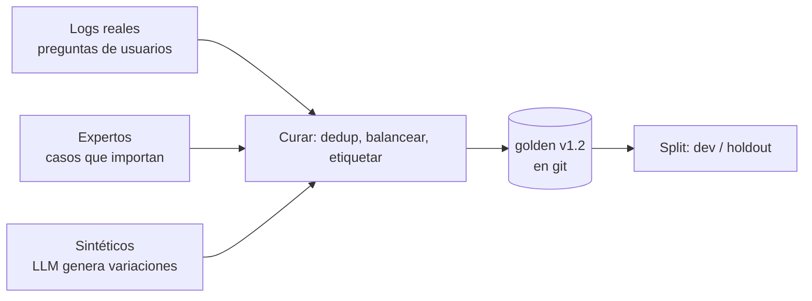

# Golden dataset

> **En una frase:** un conjunto chico, curado y versionado de casos con la respuesta esperada. Es la vara contra la que se mide todo lo demás.

## Diagrama


## Un caso
```json
{
  "id": "faq-042",
  "input": "¿Cuántos días de vacaciones tengo después de 5 años?",
  "expected": "20 días hábiles",
  "expected_sources": ["drive:1a2b3c#3"],
  "tags": ["rrhh", "multi-hop:no", "dificultad:media"],
  "user_context": { "grupos": ["grupo:empleados"] }
}
```

## Reglas
- 50 a 200 casos bien elegidos > 10 000 aleatorios. Cada caso tiene que "atrapar" algo.
- Cubrí los bordes: preguntas sin respuesta en los datos, ambiguas, con [[ACLs]] restrictivos, en otro idioma.
- Versionalo en git. Cambiar dataset y prompt a la vez = no sabés qué mejoró.
- Holdout que nadie mira: si optimizás contra el dev set, el número deja de significar algo.
- Cada fallo reportado por un usuario → un caso nuevo.

## Se conecta con
Alimenta [[Evals]], [[Tool evals]] y [[Multi-agent evals]]. Mide el recall de [[ANN HNSW]] y la calidad de [[RAG]].
