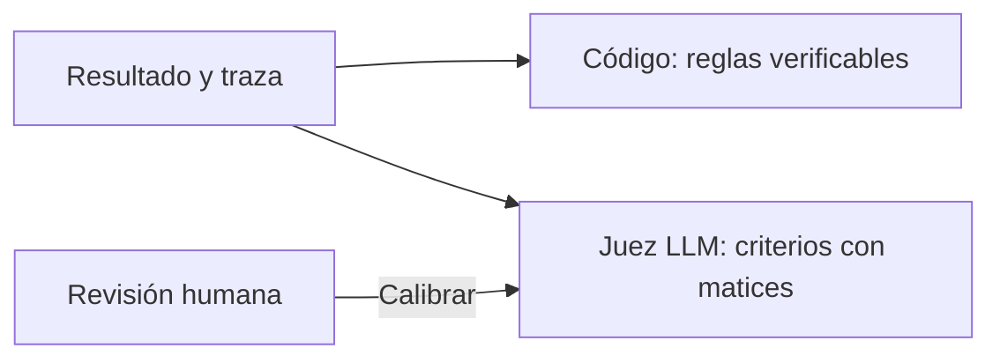

# Graders

> **En una frase:** un grader aplica un criterio explícito para decidir si el agente hizo bien una parte de la tarea.

## Tres opciones
| Evaluador | Usalo para |
|---|---|
| Código | Tools, argumentos, orden, campos, permisos y estado final |
| Juez LLM | Significado, respaldo en fuentes y explicaciones, con rúbrica |
| Humano | Resolver ambigüedades y comprobar si el juez acierta |

**Ejemplo:** el agente dice “cotización creada”. Un grader consulta si existe y comprueba cliente, moneda y monto. Otro puede evaluar la claridad del mensaje.

> [!TIP] Para recordar
> Versioná el grader. Si cambiás la vara, no atribuyas automáticamente el nuevo puntaje al agente.

**No todo necesita LLM-as-judge.** Usá código para reglas verificables. Para un juez, entregá referencia y evidencia necesaria; calibralo con humanos. Si falta evidencia, marcá “no evaluable” y revisá, sin aprobar por defecto.

## Practicá
> [!question]- ¿Cómo detectarías que tu juez aprueba respuestas convincentes pero incorrectas?
> Armá casos trampa con etiqueta humana: respuestas bien escritas, largas y seguras, pero con un monto, una moneda o una cita equivocados. Pasalas por el juez sin la etiqueta y mirá los falsos aprobados en ese grupo, no el acuerdo promedio. Si aprueba varias, dale la referencia y la evidencia, pedile que verifique cada afirmación contra la fuente y pasá a código los hechos verificables. Es el procedimiento de [[Calibración de evaluadores]].

## Se conecta con
[[Tool evals]] · [[Multi-agent evals]] · [[Regresiones y CI]]

Para llevarlo a la práctica: [[Calibración de evaluadores]].
