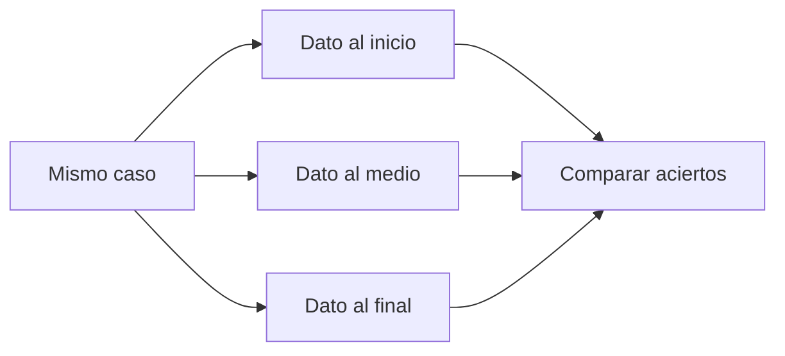

# Lost in the middle

> **En una frase:** comprobá si la posición de un dato cambia la capacidad del agente para usarlo.

## Tres pasos
1. Creá variantes con el mismo contenido, longitud aproximada y respuesta esperada; cambiá la posición de la evidencia sin alterar su significado.
2. Confirmá que el dato está en la entrada real al modelo. Si la tool lo truncó, es una falla de entrega.
3. Repetí ensayos con la misma configuración. Compará tasa de acierto y recall por posición y longitud.

**Brecha del medio:** promedio del acierto en inicio y final menos acierto en medio, en puntos porcentuales. Reportá también tamaño de muestra e incertidumbre.

## Variantes relacionadas
| Cambio | Qué debería pasar |
|---|---|
| Agregar texto irrelevante | Mantener la conclusión |
| Agregar una excepción relevante | Cambiarla según la excepción |
| Compactar el historial | Conservar restricciones necesarias |
| Quitar una página indispensable | Declarar información insuficiente |

> [!TIP] Para recordar
> Una caída es una señal, no prueba aislada de su causa. Separá posición, truncamiento, OCR y pérdida por compactación.

El estudio original es de 2023; probá los modelos y documentos actuales.

**Practicá:** ¿el resumen conserva el dato que el usuario dio diez turnos atrás?

[[Presupuesto de contexto]] · [[Golden cases agénticos]]
