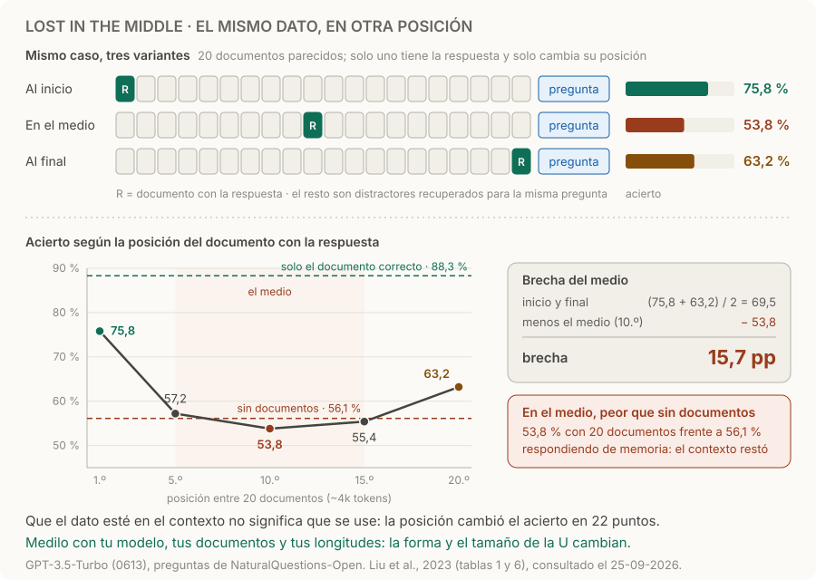

# Lost in the middle

> **En una frase:** el mismo dato, en otra posición del contexto, puede cambiar el acierto; medí si a tu agente le pasa y cuánto.

## Qué mostró el estudio
Liu et al. (2023) le dieron al modelo una pregunta y 10, 20 o 30 pasajes de Wikipedia: uno con la respuesta y el resto distractores recuperados para la misma pregunta. Solo cambiaron de lugar el pasaje con la respuesta. [Lost in the Middle](https://arxiv.org/abs/2307.03172).
- **Curva en U.** Con 20 pasajes (~4k tokens), GPT-3.5-Turbo acertó 75,8 % con la respuesta primera, 63,2 % con la respuesta última y 53,8 % con la respuesta en la posición 10.
- **Peor que sin contexto.** Sin ningún pasaje, respondiendo de memoria, acertaba 56,1 %. Con la respuesta en el medio, los documentos le restaron.
- **Más ventana no es mejor uso.** Las versiones con ventana extendida (GPT-3.5-Turbo 16K, Claude-1.3 100K) rindieron casi igual que las normales cuando el contexto entraba en las dos.
- **Cada modelo tiene su curva.** Claude-1.3 mostró una U mucho más plana: 59,9 %, 56,8 % y 60,1 %.

Un estudio más reciente con 18 modelos, entre ellos GPT-4.1, Claude 4 y Gemini 2.5, encontró que el acierto también cambia con la longitud, aun en tareas simples, y que un solo distractor ya lo baja. La posición es una causa; la longitud y los distractores son otras: el *context rot* de [[Presupuesto de contexto]]. [Context Rot](https://www.trychroma.com/research/context-rot).

## Cómo armar la eval
1. **Mismo caso, varias posiciones.** Mismo contenido, misma longitud y misma respuesta esperada; solo movés la evidencia: inicio, medio, final y, si podés, posiciones intermedias.
2. **Distractores parecidos.** Rellená con documentos de tu corpus que tu retriever devuelve para esa pregunta, como hizo el estudio. Con texto sin relación, el test sale demasiado fácil.
3. **Tus longitudes.** Repetí con los tamaños de contexto que tu agente usa en producción.
4. **Confirmá la entrega.** En la traza, verificá que el dato llegó a la entrada real del modelo. Si una tool lo truncó o el resumen lo perdió, es una falla de entrega, no de posición: [[Cobertura y uso de información]] y [[Trazas y debugging]].
5. **Compará en pares.** Es el mismo caso en cada posición: mirá qué casos acierta en una y falla en otra, con varios casos por celda (posición × longitud) y la misma configuración.

| Métrica | Cálculo | En el estudio |
|---|---|---|
| Acierto por posición | Aciertos / casos, por posición y longitud | 75,8 · 53,8 · 63,2 % |
| **Brecha del medio** | Promedio de inicio y final − medio, en puntos porcentuales | 69,5 − 53,8 = 15,7 pp |
| Contra sin documentos | Medio − acierto sin contexto | 53,8 − 56,1 = −2,3 pp |
| Contra solo la evidencia | Acierto con solo el documento correcto − medio | 88,3 − 53,8 = 34,5 pp |

Reportá también el tamaño de muestra y el intervalo: con pocos casos, una brecha de 10 puntos puede ser ruido.

## Qué probar si aparece la brecha
| Cambio | Por qué |
|---|---|
| Documentos arriba, pregunta al final | Anthropic recomienda poner los documentos largos antes de la pregunta y las instrucciones; en sus pruebas mejoró la calidad hasta un 30 %, sobre todo con varios documentos. [Prompting best practices](https://platform.claude.com/docs/en/build-with-claude/prompt-engineering/claude-prompting-best-practices) |
| Pasar menos | Un reranker y un top-k más chico dejan menos distractores y menos medio: [[Búsqueda híbrida y reranking]] |
| Citar antes de responder | Pedir que primero extraiga las citas relevantes lo ayuda a enfocarse en lo que importa; Anthropic lo recomienda para documentos largos |
| Restricciones críticas en estado | Guardarlas en estado estructurado y volver a ponerlas cerca del final, en lugar de dejarlas en el turno 3 |
| Lo relevante en los extremos | Ordenar para que lo mejor quede al inicio o al final |

Validá cada cambio con la misma eval: el acierto en el medio debería subir sin que bajen los extremos.

## Variantes de la misma eval
| Cambio | Qué debería pasar |
|---|---|
| Agregar texto irrelevante | Mantener la conclusión |
| Agregar una excepción relevante | Cambiarla según la excepción |
| Compactar el historial | Conservar las restricciones necesarias |
| Quitar una página indispensable | Declarar información insuficiente |

## Trampas
- **Relleno fácil.** El test clásico de “aguja en un pajar” esconde un dato en texto sin relación y la pregunta suele repetir sus palabras: mide búsqueda literal. En el estudio de Chroma, cuanto menos se parecía la pregunta al dato, más caía el acierto con la longitud. Usá paráfrasis y distractores parecidos.
- **Mover el dato cambiando la longitud.** Si agregás texto para desplazarlo, medís posición y longitud a la vez. Reordená sin agregar.
- **Culpar a la posición por una falla de entrega.** Una caída es una señal, no prueba de su causa: separá posición, truncamiento, OCR y pérdida por compactación.
- **Repetir la pregunta al inicio no alcanza.** En el estudio, ponerla antes y después de los documentos llevó casi al 100 % la búsqueda de claves en un JSON, pero casi no cambió el QA con varios documentos.
- **Extrapolar el estudio.** Es de 2023, con GPT-3.5-Turbo y Claude-1.3. Los modelos actuales cambian la forma y el tamaño de la U: medí los tuyos.

> [!TIP] Para recordar
> **Que el dato esté en el contexto no significa que se use. Cambialo de lugar y medí.**

## Practicá
> [!question]- El usuario dijo en el turno 3 “no me llames por teléfono” y en el turno 40 el agente propone una llamada. ¿Es lost in the middle o compactación?
> Mirá la traza del turno 40. Si la compactación borró la restricción o la resumió mal, es pérdida por compactación: [[Presupuesto de contexto]]. Si el turno 3 sigue literal en la entrada del modelo, el dato llegó y no se usó. Para confirmarlo, armá dos variantes del mismo caso: la restricción solo en el turno 3, y la restricción repetida cerca del final. Si solo la segunda la cumple, es posición. El arreglo sirve para los dos casos: guardá las restricciones críticas en estado y volvé a ponerlas cerca del final.

> [!question]- Con 40 casos por posición medís 80 % al inicio, 70 % en el medio y 78 % al final. ¿Tu agente tiene brecha del medio?
> La brecha da 79 − 70 = 9 pp, pero con 40 casos cada porcentaje tiene un margen de ±12 a ±14 puntos: puede ser ruido. Como es el mismo caso en cada posición, compará en pares: contá los casos que acierta al inicio y falla en el medio, y los que hacen lo contrario (prueba de McNemar). Si los dos conteos son parecidos, no hay evidencia de brecha; sumá casos antes de concluir.

> [!question]- Tu RAG pasa 50 pasajes al modelo para no perder recall. ¿Qué probás?
> Más pasajes suben el recall del retriever, pero también los distractores y la chance de que la evidencia quede en el medio. En el estudio, pasar de 20 a 50 documentos recuperados mejoró solo ~1,5 % en GPT-3.5-Turbo y ~1 % en Claude-1.3. Compará top-k 5, 10, 20 y 50 con reranker, midiendo el recall del retriever y el acierto de la respuesta: si el recall sube y el acierto no, pagás tokens por ruido. Ver [[RAG evals]].

## Se conecta con
[[Cobertura y uso de información]] · [[Presupuesto de contexto]] · [[Búsqueda híbrida y reranking]] · [[RAG evals]] · [[Golden cases agénticos]] · [[Trazas y debugging]]
