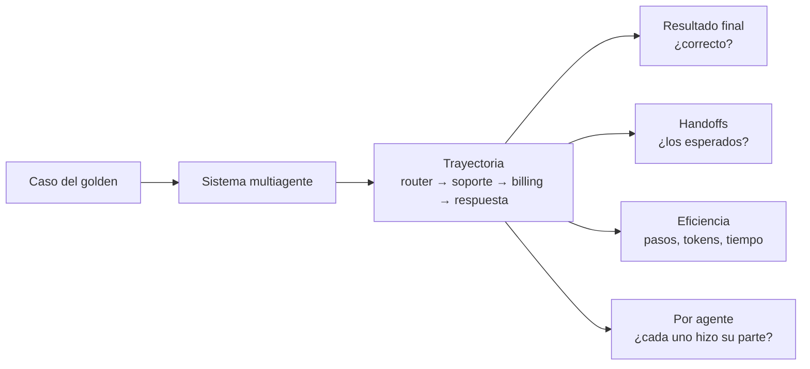

# Multi-agent evals

> **En una frase:** evaluar no solo la respuesta final sino la trayectoria: qué agente actuó, en qué orden, cuántos pasos, y si cada handoff tenía sentido.

## Diagrama

## Tres capas
| Capa | Pregunta | Métrica |
|---|---|---|
| End-to-end | ¿Se resolvió la tarea? | Task success (judge o exacto) |
| Trayectoria | ¿El camino fue razonable? | Handoff precision/recall vs esperado, pasos de más |
| Por agente | ¿Cada agente hizo bien *su* parte? | [[Tool evals]] con el contexto que le llegó |

## Fallas que solo se ven acá
- Loops: dos agentes se pasan la pelota (límite de handoffs).
- Contexto perdido en el handoff: el segundo agente vuelve a preguntar lo mismo.
- Éxito caro: llega bien, pero con 40 pasos donde alcanzaban 5.
- El orquestador sintetiza mal aunque los workers acertaron.

## Reglas
- Guardá la trayectoria completa (traces) por caso. Sin eso solo podés medir el final.
- Trayectoria esperada como *conjunto* de agentes o *secuencia parcial*, no exacta: hay más de un camino válido.
- LLM-as-judge para "razonabilidad", exacto para handoffs y límites de pasos.

## Se conecta con
Nivel de sistema de [[Evals]]. Mide [[Orquestador workers]], [[Router handoff]] y las trayectorias de [[RAG agéntico]].

Para aislar responsabilidades y comparar contra un solo agente: [[Evaluación de subagentes]].
