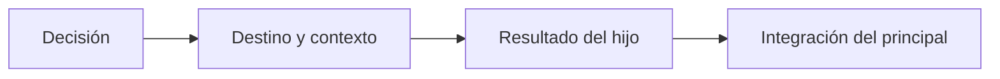

# Métricas de subagentes

> **En una frase:** puntuá cuándo delega, qué envía y qué conserva del trabajo del hijo.

## Métricas propuestas
Definí antes qué cuenta como una oportunidad de delegación y qué alternativas son válidas.

| Métrica | Cálculo | Evaluador |
|---|---|---|
| Delegación obligatoria cumplida | Oportunidades cumplidas / obligatorias | Código sobre la traza |
| Delegación indebida | Oportunidades con llamada / oportunidades donde no corresponde | Código sobre la traza |
| Destino y argumentos válidos | Llamadas válidas / llamadas evaluadas | Código; juez si hay texto libre |
| Contexto suficiente | Datos necesarios entregados / necesarios para las tareas delegadas | Campos o referencia semántica |
| Retención al integrar | Hallazgos correctos del hijo usados correctamente / hallazgos del hijo que debían usarse | Campos o juez calibrado |

Denominador cero: “no aplica”. Reportá resultados por cliente y caso, además del agregado.

**Ejemplo:** el hijo encuentra cinco restricciones necesarias; el principal respeta cuatro: retención 4/5. Si la omitida es crítica, el caso falla.

> [!TIP] Para recordar
> Estas métricas no reemplazan el éxito final: un hijo puede omitir información. Medí también calidad, costo total y latencia frente a un solo agente.

**Practicá:** ¿cómo puntuarías una delegación opcional que mejora calidad y aumenta costo?

[[Evaluación de subagentes]] · [[Cobertura y uso de información]] · [[Graders]]
