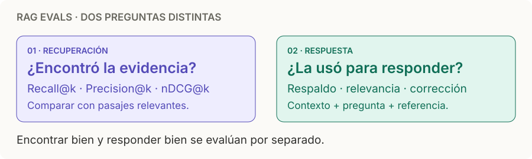

# RAG evals

> **En una frase:** medí por separado si encontraste la evidencia correcta y si la respuesta la usó bien.

## Recuperación · ¿qué trajo?
| Métrica | Recordatorio |
|---|---|
| **Recall@k** | Relevantes recuperados en top-k / total de relevantes etiquetados |
| **Precision@k** | Relevantes entre los primeros k / k |
| **nDCG@k** | Premia que lo más relevante aparezca primero; compara con el orden ideal |

**Ejemplo:** hay 4 pasajes relevantes; recuperás 5 y 3 son relevantes → **Recall@5 = 75%**, **Precision@5 = 60%**.

## Respuesta · ¿qué dijo?
| Métrica | Recordatorio |
|---|---|
| **Groundedness / faithfulness** | ¿Las afirmaciones están respaldadas por el contexto recuperado? |
| **Answer relevance** | ¿Responde a la pregunta, sin desviarse? |
| **Answer correctness** | ¿Coincide con la respuesta de referencia y sus hechos esperados? |

En Ragas, **faithfulness = afirmaciones respaldadas / afirmaciones evaluadas**. Groundedness apunta al mismo aspecto, pero la escala depende del evaluador. [Ragas](https://docs.ragas.io/en/stable/concepts/metrics/available_metrics/faithfulness/) · [Evaluadores de RAG](https://learn.microsoft.com/en-us/azure/foundry/concepts/evaluation-evaluators/rag-evaluators).

> [!TIP] No confundir
> Una respuesta puede ser fiel a una fuente equivocada, o correcta pero sin respaldo en el contexto. Medí ambas cosas.

## Reglas rápidas
- Guardá pregunta, pasajes relevantes, contexto recuperado, respuesta generada y referencia en el [[Golden dataset]].
- Fijá **k** y la unidad (documento, pasaje o escena). Aquí Recall@k usa relevancia etiquetada; el recall de [[ANN HNSW]] compara vecinos con búsqueda exacta.
- Calibrá el juez LLM con humanos. Agregá casos sin respuesta, permisos restrictivos y citas incorrectas; registrá latencia y costo por caso.

## Se conecta con
[[Chunking]] · [[Modelos de embedding]] · [[RAG básico]] · [[RAG multimedia]] · [[Evals]]
