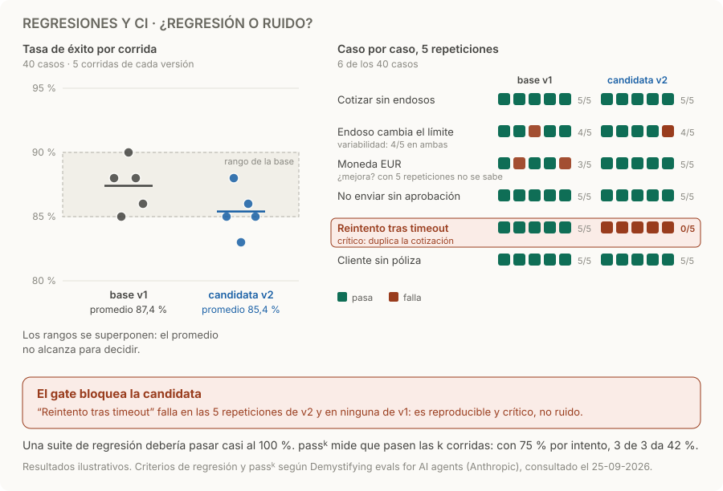

# Regresiones y CI

> **En una frase:** un gate de CI bloquea cambios que no cumplen criterios de calidad, seguridad o presupuesto.

## Cómo funciona
1. **Base y candidata en las mismas condiciones.** Mismo dataset, mismos graders y misma configuración. Cambiá una cosa por vez: prompt, modelo, tools o índice.
2. **Varias corridas por caso.** Las salidas del modelo varían entre ejecuciones; repetir los casos permite estimar la tasa de éxito y su incertidumbre. [Evals para agentes](https://www.anthropic.com/engineering/demystifying-evals-for-ai-agents).
3. **Caso por caso, además del promedio.** Una regresión real se concentra en casos o grupos concretos y se repite en cada corrida; el ruido cambia de casos entre corridas.
4. **Criterios definidos antes.** Fallos críticos que bloquean siempre, como acciones duplicadas, permisos o datos de otro cliente, y tolerancias de calidad, costo y latencia, también por cliente.
5. **Dos suites.** La de regresión cubre lo que ya funcionaba y debería pasar casi al 100 %; la de capacidad mide lo que todavía cuesta y empieza baja. El gate se apoya en la de regresión; la de capacidad muestra el progreso.

En agentes que actúan importa la consistencia. **pass@k** es la probabilidad de acertar al menos una vez en k intentos; **pass^k**, la de acertar en los k. Con 75 % por intento, pass@3 ronda el 98 %, pero pass^3 es 42 %.

## Qué hacer con cada resultado
| Resultado | Decisión |
|---|---|
| Un caso crítico falla de forma reproducible | Bloquear, aunque el promedio no cambie |
| La tasa cae fuera del rango de la base en varias corridas | Bloquear o investigar, según la tolerancia fijada |
| La diferencia queda dentro del rango de la base | No concluir; sumar repeticiones o casos si importa |
| Mejora el promedio, pero empeora un cliente | Bloquear para ese cliente o investigar: [[Evals por cliente y producción]] |
| Costo o latencia fuera de tolerancia | Bloquear aunque la calidad suba |

## Ejemplo
La candidata v2 cambia a un modelo más barato. En 5 corridas de 40 casos, su tasa va de 83 a 88 % y la de la base de 85 a 90 %: los rangos se superponen y el promedio no decide. Caso por caso, “reintento tras timeout” pasa 5 de 5 en la base y falla 5 de 5 en la candidata, porque duplica la cotización. Es reproducible y crítico: el gate bloquea y el ahorro no lo compensa. Números ilustrativos, los mismos del diagrama.

## Trampas
- **Una sola corrida.** Una favorable no demuestra una mejora, y una desfavorable no demuestra una regresión.
- **Cambiar dos cosas a la vez.** Si cambian el modelo y el grader, no sabés cuál movió el puntaje: versioná también el grader ([[Graders]]).
- **El promedio como único criterio.** Esconde fallos críticos y regresiones de un cliente.
- **Caché de respuestas activa.** Devolver salidas guardadas esconde regresiones: desactivala o aislala por versión al evaluar ([[Evals de caché]]).
- **Casos que ya no informan.** Cuando un caso de capacidad pasa de forma estable, movelo a la suite de regresión.
- **Creer que el gate alcanza.** Suite rápida en cada cambio y una más amplia antes de desplegar; después, monitoreo en producción.

> [!TIP] Para recordar
> **El promedio muestra la tendencia; caso por caso se decide. Un fallo crítico reproducible bloquea siempre.**

## Practicá
> [!question]- ¿Cómo distinguirías una regresión real de una fluctuación entre ejecuciones?
> Primero medí la fluctuación: corré la versión base varias veces sobre los mismos casos y mirá cuánto varía sin cambiar nada. Después compará caso por caso, con repeticiones: una regresión real se concentra en casos o grupos concretos y se repite en cada corrida; el ruido cambia de casos entre corridas. Para la tasa de éxito, reportá el intervalo y usá una prueba pareada, porque son los mismos casos. Un fallo crítico que se reproduce bloquea aunque el promedio no cambie.

> [!question]- Tu agente acierta 90 % por intento en un caso de cobro. ¿Qué probabilidad hay de que pase 5 corridas seguidas, y qué te dice eso?
> pass^5 = 0,9⁵ ≈ 59 %: el gate lo marcaría como fallido en 4 de cada 10 revisiones, y en producción 1 de cada 10 cobros saldría mal. “Casi siempre” no alcanza para una acción crítica. Subí la confiabilidad donde no dependa del modelo: validación por código de monto y cliente, idempotencia y aprobación humana: [[Ejecución y recuperación]] y [[Control humano y permisos]].

> [!question]- La candidata mejora el promedio 2 puntos, pero la extracción de moneda del cliente B cae de 95 % a 80 %. ¿Pasa el gate?
> No, si fijaste tolerancias por cliente: el promedio global diluye la caída de un grupo chico. Antes de bloquear, comprobá con repeticiones que la caída no es ruido. Después mirá qué tienen de particular los casos de B, como el idioma o el formato de sus documentos, y sumá esos casos a su suite: [[Evals por cliente y producción]].

## Se conecta con
[[Golden dataset]] · [[Graders]] · [[Calibración de evaluadores]] · [[Evals por cliente y producción]] · [[Evals de caché]] · [[Trazas y debugging]]
