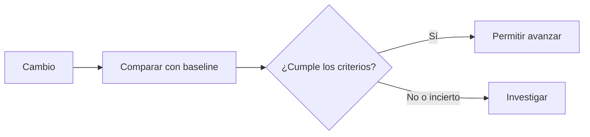

# Regresiones y CI

> **En una frase:** un gate de CI bloquea cambios que no cumplen criterios de calidad, seguridad o presupuesto.

## Tres ideas
- **Comparación justa:** mismo dataset, grader y condiciones. Compará casos individuales, además del promedio.
- **Variabilidad:** repetí casos para estimar la tasa de éxito y su incertidumbre. Una ejecución favorable no demuestra una mejora.
- **Criterios previos:** definí fallos críticos que bloquean y tolerancias de calidad, costo y latencia, también por cliente.

**Ejemplo:** un modelo resulta más barato, pero duplica una acción en un caso crítico. El ahorro no compensa ese fallo.

> [!TIP] Para recordar
> Suite rápida en cada cambio; evaluación más amplia antes del despliegue. Pasar el gate no elimina el monitoreo posterior.

**Practicá:** ¿cómo distinguirías una regresión real de una fluctuación entre ejecuciones?

[[Evals por cliente y producción]] · [[Ejecución y recuperación]]
