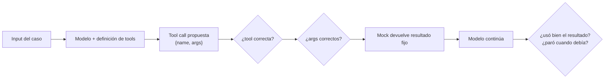

# Tool evals

> **En una frase:** dado un input, ¿el modelo eligió la herramienta correcta, con los argumentos correctos, y usó bien el resultado? Podés aislar la decisión con herramientas simuladas.

## Diagrama

## Qué medir
| Métrica | Pregunta | Cómo se calcula |
|---|---|---|
| Tool selection | ¿Eligió la tool esperada? | Exacto |
| Arg accuracy | ¿Los argumentos son correctos? | Exacto por campo, judge para texto libre |
| Unnecessary calls | ¿Llamó cuando no hacía falta? | Llamadas vs esperado |
| Missing calls | ¿No llamó cuando debía? | Casos con `expected_tool != null` |
| Error recovery | Si la tool falla, ¿reintenta o inventa? | Mock que devuelve error |

## Reglas
- Mockeá las tools para controlar sus respuestas; el modelo sigue siendo variable. Complementá con pruebas de integración en un entorno de prueba.
- Un caso por tool por comportamiento: "usa buscar_pedido", "no usa nada", "pide aclaración".
- Cambiaste la descripción de una tool → corré esto. La descripción es el prompt de la tool.

## Se conecta con
Nivel de unidad de [[Evals]]. Los casos salen del [[Golden dataset]]. En [[RAG agéntico]] la "tool" es cada índice o fuente.

La base conceptual está en [[Tools y function calling]]; los permisos y las aprobaciones en [[Control humano y permisos]].
