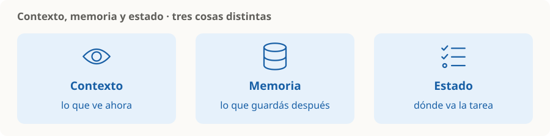

# Contexto, memoria y estado

> **En una frase:** contexto es lo que el modelo ve ahora; memoria es lo que guardás para después; estado es dónde va la tarea.

## No confundir
| Concepto | Ejemplo |
|---|---|
| Contexto | Instrucciones, mensajes recientes y documentos recuperados para esta llamada |
| Memoria | Preferencia del usuario conservada entre sesiones |
| Estado | Pedido elegido, pasos completados y aprobación pendiente |

**Ejemplo:** al reservar un viaje, el contexto incluye la consulta actual; la memoria puede indicar “prefiere pasillo”; el estado registra qué vuelo falta confirmar.

## Tres decisiones
- **Seleccionar:** incorporar la información que ayuda a resolver la tarea.
- **Resumir o recuperar:** evitar arrastrar todo el historial; conservar detalles que importan.
- **Persistir:** decidir qué guardar, durante cuánto tiempo y con qué permisos.

La memoria almacenada solo influye cuando se recupera y se incorpora al contexto; no implica cambiar los pesos del modelo. El estado de la aplicación permite continuar una tarea aunque cambie la conversación.

> [!TIP] Para recordar
> Más contexto no siempre ayuda. Un resumen también puede perder información importante. [Context engineering](https://www.anthropic.com/engineering/effective-context-engineering-for-ai-agents).

[[RAG]] · [[Router handoff]] · [[Control humano y permisos]]

Para llevarlo al runtime: [[Presupuesto de contexto]] · [[Ejecución y recuperación]].
