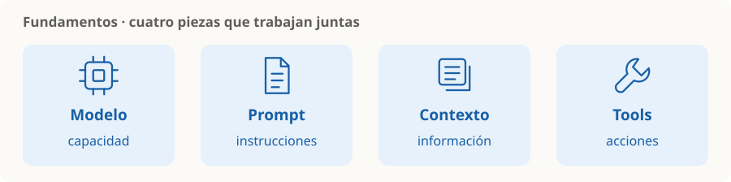

# Fundamentos

> **En una frase:** elegir el modelo, darle información útil y conectar su respuesta con el resto de la aplicación.



## Las cuatro piezas
| Nodo | Pregunta que responde |
|---|---|
| [[LLMs y elección de modelo]] | ¿Qué modelo sirve para esta tarea? |
| [[Prompts y salidas estructuradas]] | ¿Qué le pido y en qué formato lo necesito? |
| [[Contexto, memoria y estado]] | ¿Qué ve ahora y qué conserva después? |
| [[Tools y function calling]] | ¿Cómo consulta datos o realiza una acción? |

## Orden sugerido
Modelo → prompt → contexto → tools; después elegí cómo mejorar con [[Prompting, RAG o fine-tuning]]. Después: [[RAG]] para trabajar con fuentes y [[Multiagentes]] para decidir cómo organizar la tarea. [[Runtime de agentes]] lleva esas piezas a ejecuciones recuperables. [[Seguridad]] y [[Evals]] acompañan todo el recorrido.


## Estado de los nodos
```dataview
TABLE WITHOUT ID file.link AS nodo, estado
FROM "fundamentos" WHERE tipo != "mapa" SORT orden
```

[[Fundamentos.canvas|Abrir el canvas de Fundamentos]]
