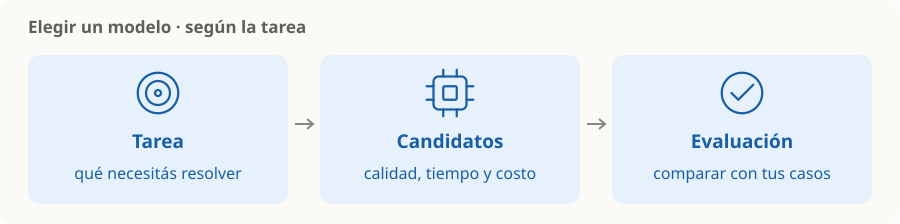

# LLMs y elección de modelo

> **En una frase:** elegí por cómo resuelve tus tareas, con el costo y el tiempo que podés aceptar.

## Vocabulario mínimo
| Concepto | Para recordar |
|---|---|
| LLM | Modelo que genera lenguaje a partir de una entrada; una respuesta fluida puede ser incorrecta |
| Tokens | Unidades con las que el modelo procesa texto; no equivalen exactamente a palabras |
| Ventana de contexto | Capacidad de información que puede procesar en una llamada |
| Modalidad | Texto, imagen, audio o video que admite; depende del modelo |
| Inferencia | Usar el modelo para producir una respuesta |

## Cómo elegir, a grandes rasgos
- **Capacidad:** idioma, tarea y modalidades necesarias.
- **Calidad:** probar con el mismo [[Golden dataset]], incluidos casos difíciles.
- **Costo y latencia:** comparar costo por tarea resuelta y tiempo de respuesta.
- **Ejecución:** API o infraestructura propia, según privacidad, mantenimiento y recursos.

**Ejemplo:** clasificar tickets y analizar un contrato largo pueden necesitar modelos distintos. Una ventana mayor permite más contenido, pero no garantiza que se use bien.

> [!TIP] Criterio
> Elegí el candidato que cumpla tu objetivo de calidad dentro del presupuesto. Repetí la evaluación cuando cambies de versión.

## Se conecta con
[[Prompts y salidas estructuradas]] · [[Contexto, memoria y estado]] · [[Operación en producción]]
