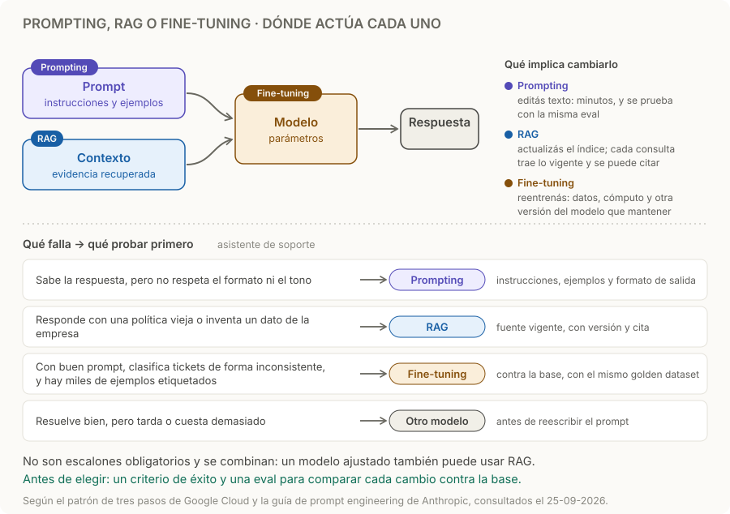

# Prompting, RAG o fine-tuning

> **En una frase:** elegí según la falla: instrucciones poco claras, información ausente o comportamiento que necesita entrenamiento.

## Cómo funciona
1. **Antes de elegir, medí.** Definí qué es éxito, cómo lo vas a comprobar y un primer prompt como base. Sin eso no sabés si un cambio mejoró. [Prompt engineering](https://platform.claude.com/docs/en/build-with-claude/prompt-engineering/overview).
2. **Cada opción actúa en un lugar distinto:**

| Opción | Qué cambia | Cuándo probarla | Qué implica cambiarla |
|---|---|---|---|
| **Prompting** | Instrucciones y ejemplos del contexto | La tarea necesita criterios más claros; empezá por aquí | Editar texto y volver a correr la eval |
| **RAG** | Evidencia recuperada en cada consulta | Necesitás fuentes propias, actualizables o citables | Mantener el índice al día; un RAG de producción es un sistema en sí: [[RAG básico]] |
| **Fine-tuning** | Parámetros del modelo o adaptadores, mediante entrenamiento | Buscás un comportamiento especializado y tenés un conjunto de ejemplos amplio y variado | Datos, cómputo y otra versión del modelo que mantener |

3. **Empezá por lo más barato.** El patrón de Google Cloud propone empezar con prompting, que da la mejora más inmediata; sumar RAG para información actualizada; e invertir en fine-tuning cuando haya un conjunto de datos suficientemente grande y variado. No es una progresión estricta y las opciones se combinan: un modelo ajustado también puede consultar documentos mediante RAG. [Patrón de tres pasos](https://cloud.google.com/blog/products/ai-machine-learning/three-step-design-pattern-for-specializing-llms/).
4. **Algunas fallas no son de ninguna de las tres.** La latencia y el costo a veces mejoran más fácil con otro modelo: [[LLMs y elección de modelo]]. Los datos vivos y las acciones van por [[Tools y function calling]].

## Ejemplo
En un asistente de soporte, el prompt define el tono y el formato; RAG aporta el manual vigente con su versión. Fine-tuning puede ayudar a clasificar tickets si, con buen prompt y ejemplos, la clasificación sigue siendo inconsistente y hay miles de tickets etiquetados, y siempre que la mejora justifique entrenar y mantener otra versión. Si todo funciona pero tarda o cuesta demasiado, probá otro modelo antes de reescribir el prompt.

## Antes de entrenar
- Compará contra una base de prompt y ejemplos con el mismo [[Golden dataset]].
- Separá entrenamiento, validación y prueba; evitá duplicados que filtren respuestas entre conjuntos.
- Medí calidad, costo por tarea y regresiones. Entrenar no garantiza mejorar.

## Trampas
- **Entrenar para enseñar datos que cambian.** Fine-tuning no reemplaza consultar la fuente vigente ni asegura citas correctas: un modelo ajustado puede responder mal y sin referencias. Para precios actuales, consultá la fuente.
- **El prompt que crece sin fin.** Si cada caso nuevo suma una regla, revisá si en realidad falta evidencia (RAG) o si la tarea necesita ejemplos.
- **RAG para arreglar el formato.** Traer más documentos no hace que respete el formato; eso es del prompt o de la salida estructurada: [[Prompts y salidas estructuradas]].
- **Cambiar sin base.** Sin la misma eval antes y después, no sabés qué opción funcionó: [[Regresiones y CI]].

> [!TIP] Para recordar
> **Formato y criterio → prompt. Datos propios o vigentes → RAG. Comportamiento que no se logra con prompt y ejemplos → fine-tuning. Siempre contra la misma eval.**

## Practicá
> [!question]- ¿Qué cambiarías primero si el modelo escribe bien, pero responde con una política antigua?
> La fuente, no el estilo. Si escribe bien, el prompt de tono funciona y no hace falta entrenar: le falta la política vigente. Con RAG, comprobá que el índice tenga la versión nueva, que la anterior quede fuera o marcada como vencida, y que el prompt pida responder con la fuente y su fecha. Fine-tuning no lo resuelve: fijaría una versión de la política en el modelo y habría que reentrenar en cada cambio.

> [!question]- Tu prompt tiene 40 reglas y cada semana sumás una por un caso nuevo. ¿Qué revisás?
> Qué tipo de falla estás parchando. Si son datos, como políticas, precios o excepciones de un cliente, sacalos del prompt y llevalos a RAG con su versión. Si son criterios que se repiten, probá unos pocos ejemplos representativos en lugar de reglas sueltas. Si con buen prompt y ejemplos el comportamiento sigue inconsistente y tenés muchos ejemplos etiquetados, evaluá fine-tuning contra la base. En todos los casos, cada regla nueva debería llegar con su caso en el [[Golden dataset]], para detectar si rompe otra.

> [!question]- Un proveedor te ofrece ajustar un modelo con tus 300 tickets para que “sepa” tu lista de precios. ¿Qué le respondés?
> Que esa no es la palanca. Los precios cambian, y un modelo ajustado no se actualiza solo ni cita la fuente: puede dar un precio viejo con total seguridad. Los precios van por RAG o por una tool que consulte la base: [[Tools y function calling]]. Además, 300 ejemplos puede que no alcancen para un conjunto amplio y variado. El ajuste podría servir para otra cosa, como el tono o la clasificación de tickets, medido contra la base.

## Se conecta con
[[Prompts y salidas estructuradas]] · [[RAG básico]] · [[LLMs y elección de modelo]] · [[Tools y function calling]] · [[Golden dataset]] · [[Regresiones y CI]]
