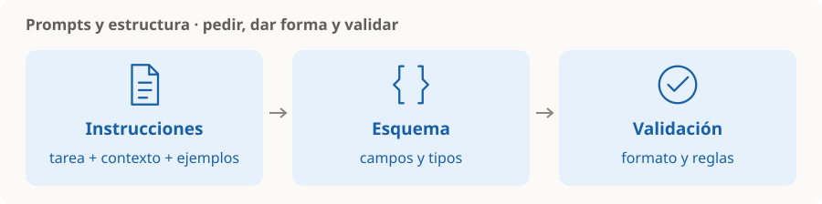

# Prompts y salidas estructuradas

> **En una frase:** el prompt expresa la tarea; el esquema define la forma que la aplicación espera recibir.

## Qué conviene definir
| Pieza | Recordatorio |
|---|---|
| Tarea | Qué resultado necesitás y con qué criterio |
| Contexto | Datos y restricciones relevantes |
| Ejemplos | Casos que aclaran una clasificación o formato ambiguo |
| Salida | Texto libre para leer; estructura para procesar |

**Ejemplo:** “Clasificá el ticket y devolvé categoría y prioridad” → `{"categoria":"soporte","prioridad":"alta"}`.

## Tres cosas distintas
- Pedir “respondé en JSON” es una instrucción.
- Una salida estructurada con un esquema soportado restringe campos y tipos.
- Validar reglas del negocio comprueba que los valores tengan sentido.

Un JSON válido todavía puede contener una conclusión equivocada. Contemplá respuestas incompletas o rechazos según la API. [Referencia de salidas estructuradas](https://platform.claude.com/docs/en/build-with-claude/structured-outputs).

> [!TIP] Para recordar
> Claridad de la tarea + ejemplos útiles + validación. Versioná el prompt y comprobá los cambios con [[Evals]].

[[Tools y function calling]] · [[Contexto, memoria y estado]] · [[Guardrails]]
