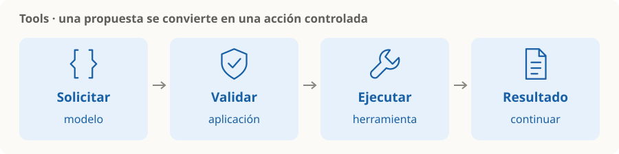

# Tools y function calling

> **En una frase:** el modelo propone una herramienta y sus argumentos; la aplicación controla su ejecución y devuelve el resultado.

## El recorrido
1. La aplicación describe las herramientas disponibles.
2. El modelo solicita una llamada con argumentos.
3. La aplicación valida argumentos, permisos y aprobaciones necesarias.
4. Ejecuta la herramienta y entrega el resultado para continuar o responder.

**Ejemplo:** “¿Dónde está mi pedido?” → `consultar_pedido(id)` → estado del envío → respuesta al usuario. Consultar un pedido y cancelarlo requieren controles distintos.

## Qué es cada cosa
| Concepto | Recordatorio |
|---|---|
| Tool | Capacidad disponible: consultar una API, buscar o editar un archivo |
| Function calling | Forma estructurada de solicitar su uso |
| MCP | Protocolo para conectar aplicaciones con servidores que exponen herramientas y otros recursos |

MCP facilita la conexión; la aplicación sigue necesitando políticas de permisos y ejecución. [Arquitectura de MCP](https://modelcontextprotocol.io/docs/learn/architecture).

> [!TIP] Para recordar
> Definí claramente qué hace cada tool, sus entradas y sus errores. Una llamada propuesta no prueba que la acción se completó.

## Se conecta con
[[Tool evals]] · [[Agente individual vs workflow vs multiagente]] · [[Guardrails]] · [[Control humano y permisos]]

Para ejecutar con recuperación y límites: [[Runtime de agentes]] → [[Ejecución y recuperación]].

Para construir y conectar servidores: [[MCP]] → [[Arquitectura MCP]] → [[Construir un servidor MCP]].
