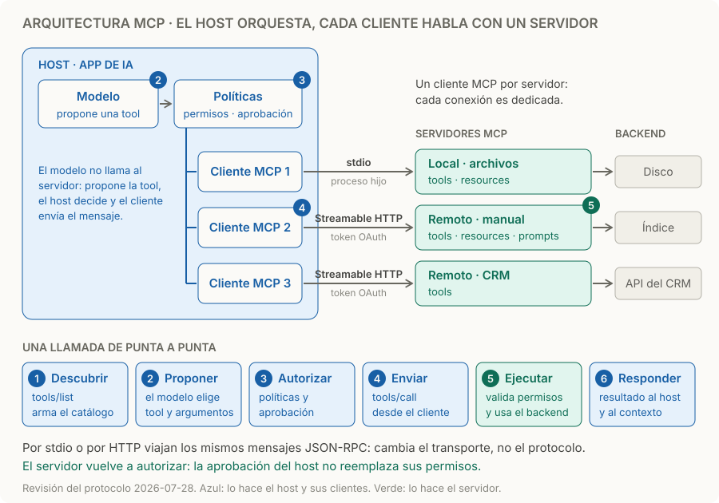

# Arquitectura MCP

> **En una frase:** el host coordina el modelo y sus políticas, crea un cliente MCP por cada servidor, y cada servidor expone capacidades sobre su backend.

## Quién hace qué

| Componente | Responsabilidad | En un asistente de soporte |
|---|---|---|
| Host | Conversación, contexto, modelo y políticas de ejecución | Aplicación donde preguntás |
| Cliente MCP | Mantener una conexión dedicada con **un** servidor e intercambiar mensajes | Adaptador dentro del host, uno por servidor |
| Servidor MCP | Publicar contratos y resolver operaciones autorizadas | Servicio conectado al manual |
| Backend | Datos y lógica de negocio | Buscador, documentos y CRM |

Un servidor local por stdio suele atender a un solo cliente; uno remoto por Streamable HTTP, a muchos. Un servidor MCP no necesita tener un LLM propio. [Arquitectura oficial](https://modelcontextprotocol.io/docs/2026-07-28/learn/architecture).

## Dos capas

| Capa | Qué define | Dónde seguir |
|---|---|---|
| Datos | Mensajes JSON-RPC 2.0: descubrimiento, tools, resources, prompts, elicitation y notificaciones | [[Tools en MCP]] · [[Resources en MCP]] · [[Prompts en MCP]] |
| Transporte | Cómo viajan: stdio o Streamable HTTP, encuadre de mensajes y autenticación | [[Conexión y transportes MCP]] · [[Autenticación y autorización MCP]] |

Los mismos mensajes viajan por cualquier transporte: pasar de stdio a HTTP no cambia las tools, cambia cómo se conecta y se autentica.

## Qué ofrece cada lado
- **El servidor:** tools, que el modelo propone usar; resources, que la aplicación decide leer; y prompts, que el usuario elige.
- **El cliente:** elicitation, para que el servidor pida un dato o una confirmación al usuario. Sampling y logging quedaron obsoletos en `2026-07-28`: un servidor nuevo llama directo a su proveedor de LLM y registra en `stderr` u OpenTelemetry.
- **Notificaciones:** el cliente se suscribe con `subscriptions/listen` y el servidor avisa cambios, por ejemplo en la lista de tools. Son best effort: no reemplazan volver a consultar.

## Ejemplo de punta a punta
1. **Descubrir:** el cliente pide `tools/list` y el host arma el catálogo que ve el modelo.
2. **Proponer:** ante “¿Cómo pido un reembolso?”, el modelo propone `buscar_documentos`.
3. **Autorizar:** el host aplica sus políticas; si la tool tiene efectos, pide aprobación.
4. **Enviar:** el cliente manda `tools/call`. En `2026-07-28` cada petición lleva versión y capacidades en `_meta`; no hay sesión del protocolo.
5. **Ejecutar:** el servidor valida argumentos y permisos del usuario, consulta el backend y devuelve fragmentos.
6. **Responder:** el host incorpora el resultado y el modelo redacta con evidencia.

El servidor de búsqueda no recibe necesariamente toda la conversación ni controla la respuesta final.

## Cuándo sí / cuándo no

| Usalo cuando | Evitalo cuando |
|---|---|
| La misma capacidad se usa desde varios hosts: IDE, chat, agente | Es una función interna de un solo agente: una tool directa requiere menos infraestructura |
| Querés separar la integración del agente, con su propio despliegue y permisos | No podés sostener contratos, versiones, credenciales y observabilidad entre procesos |
| Ya existe un servidor mantenido para ese sistema | Esperás que MCP aporte planificación, memoria o calidad de recuperación: no lo hace |

## Trampas
- **Confundir cliente con host.** El cliente no decide nada: el modelo y las políticas están en el host.
- **Aprobar en el host no autoriza en el servidor.** El servidor vuelve a validar identidad, scope y permisos de negocio: [[Autenticación y autorización MCP]].
- **Servidores de terceros.** Las descripciones de tools y sus resultados entran al contexto del modelo; un servidor malicioso o comprometido puede intentar darle instrucciones: [[Guardrails]].
- **Demasiadas tools.** Varios servidores suman muchos esquemas; cargalos bajo demanda: [[Presupuesto de contexto]].
- **Mezclar revisiones.** `2025-11-25` empieza con `initialize` y puede tener sesión; `2026-07-28` es stateless: [[Conexión y transportes MCP]] y [[MCP stateless y estado]].

> [!TIP] Para recordar
> **El modelo propone, el host decide, el cliente transporta y el servidor autoriza y ejecuta.**

## Practicá
> [!question]- ¿Por qué el host crea un cliente por servidor en lugar de uno para todos?
> Cada conexión tiene su transporte, credenciales, capacidades y versión: stdio con un proceso local, HTTP con un token emitido para otro servicio. Separarlas aísla fallas y permisos: si el servidor del CRM cae o su token vence, el de archivos sigue funcionando, y cada token va solo al servidor para el que fue emitido.

> [!question]- El usuario aprobó en el host “cancelar el pedido 123”. ¿El servidor tiene que verificar algo más?
> Sí. La aprobación prueba que el usuario aceptó la propuesta, no que tenga permiso sobre ese pedido. El servidor valida token, scope y la regla de negocio (¿el pedido 123 es de ese usuario o tenant?) antes de ejecutar, y usa una clave de idempotencia por si la llamada se reintenta. Ver [[Control humano y permisos]] y [[Ejecución y recuperación]].

> [!question]- Tu servidor usaba sampling para resumir documentos con el modelo del host. ¿Qué cambia con `2026-07-28`?
> Sampling está obsoleto. O el servidor llama directo a un proveedor de LLM, con su propia clave, costo y límites, o devuelve el contenido y deja que el host lo resuma. Hay que decidir quién paga, qué modelo se usa y qué datos salen del servidor.

## Se conecta con

[[MCP]] · [[Conexión y transportes MCP]] · [[Tools en MCP]] · [[Autenticación y autorización MCP]] · [[Tools y function calling]] · [[Agente individual vs workflow vs multiagente]]
