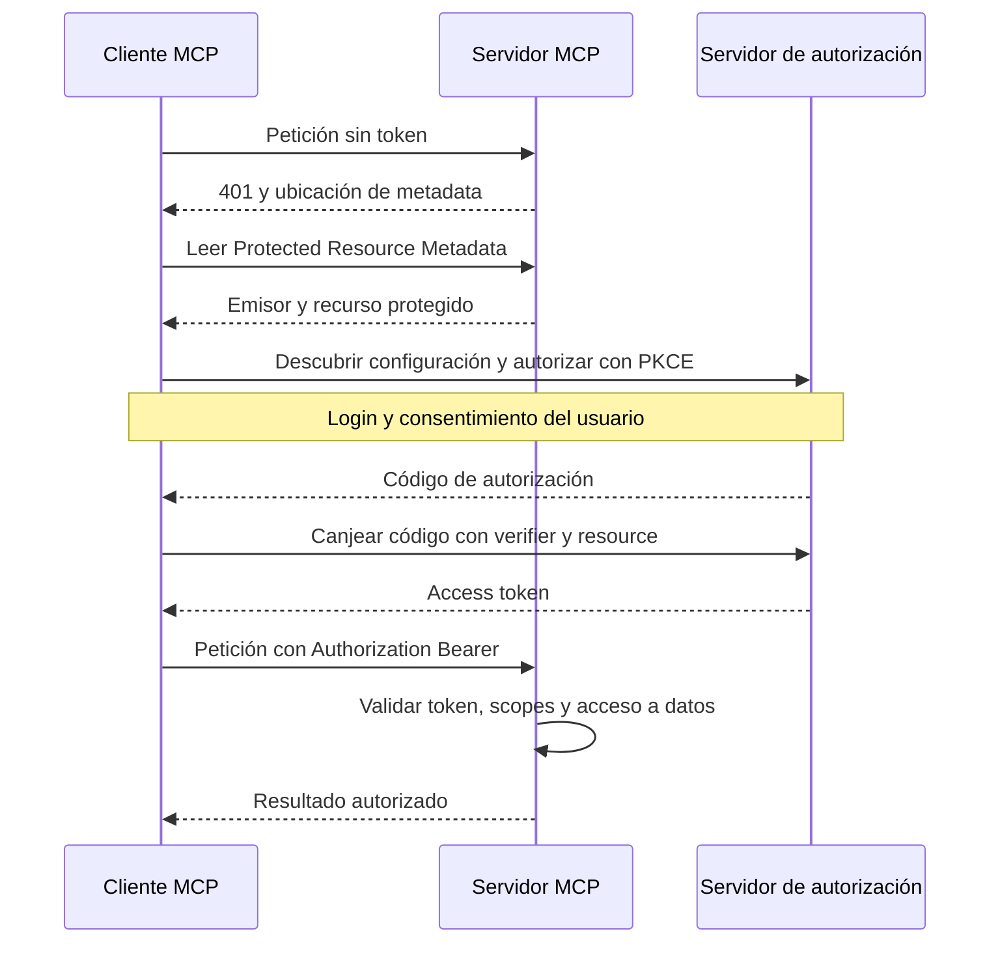

# Autenticación y autorización MCP

> **En una frase:** autenticación establece quién llama; autorización decide qué puede hacer y qué datos puede leer.

## Tres controles distintos

| Control | Ejemplo de soporte |
|---|---|
| Identidad | El access token identifica al usuario y a la aplicación cliente |
| Scope | `docs:read` permite usar el servicio de lectura |
| ACL de negocio | El usuario solo ve documentos de sus proyectos y tenant |

Un token válido no concede acceso a todos los documentos. Una aprobación en el host tampoco reemplaza la autorización del servidor.

## Conexión HTTP protegida



El cliente obtiene una identidad de aplicación mediante un mecanismo de registro compatible. El proveedor de identidad realiza el login; el servidor de autorización emite tokens, y MCP actúa como **resource server**. El cliente debe solicitar un token destinado al servidor MCP mediante `resource` y enviarlo en cada petición protegida. Las revisiones difieren en registro y endurecimiento del flujo; usá la especificación de la versión implementada. [Autorización actual](https://modelcontextprotocol.io/specification/2026-07-28/basic/authorization), [autorización 2025-11-25](https://modelcontextprotocol.io/specification/2025-11-25/basic/authorization).

## Implementación del lado servidor: laboratorio JWT

Este complemento para [[Construir un servidor MCP]] valida **access tokens JWT RS256** emitidos por un proveedor externo. No implementa el login, registro del cliente ni emisión de tokens. Para tokens opacos, usá introspección en lugar de decodificación JWT.

Guardá como `auth.py`. El contrato del proveedor debe incluir `sub`, `client_id` y `scope`; adaptalo explícitamente si utiliza otros claims. `ISSUER_URL`, `JWKS_URL` y `MCP_RESOURCE_URL` son configuración de confianza, nunca URLs tomadas del token.

```python
import asyncio
import os

import jwt
from mcp.server.auth.provider import AccessToken
from mcp.server.auth.settings import AuthSettings
from pydantic import AnyHttpUrl


def build_auth() -> dict:
    issuer = os.environ["ISSUER_URL"]
    audience = os.environ["MCP_RESOURCE_URL"]
    jwks_url = os.environ["JWKS_URL"]
    if not all(url.startswith("https://") for url in (issuer, audience, jwks_url)):
        raise ValueError("La configuración remota requiere HTTPS")
    jwks = jwt.PyJWKClient(jwks_url, timeout=5)

    class Verifier:
        async def verify_token(self, token: str) -> AccessToken | None:
            try:
                key = await asyncio.to_thread(jwks.get_signing_key_from_jwt, token)
                claims = jwt.decode(
                    token, key.key, algorithms=["RS256"],
                    issuer=issuer, audience=audience,
                    options={"require": ["exp", "iss", "aud", "sub", "client_id", "scope"]},
                )
                if not all(isinstance(claims[k], str) and claims[k]
                           for k in ("sub", "client_id", "scope")):
                    return None
                return AccessToken(
                    token=token, client_id=claims["client_id"],
                    subject=claims["sub"], claims=claims,
                    scopes=claims["scope"].split(),
                    expires_at=int(claims["exp"]), resource=audience,
                )
            except (jwt.PyJWTError, ValueError, TypeError, OSError):
                return None

    return {
        "token_verifier": Verifier(),
        "auth": AuthSettings(
            issuer_url=AnyHttpUrl(issuer),
            resource_server_url=AnyHttpUrl(audience),
            required_scopes=["docs:read"],
            validate_token_resource=True,
        ),
    }
```

En `server.py`, reemplazá la construcción de `mcp` por:

```python
from auth import build_auth

mcp = FastMCP(
    "Manual de soporte", stateless_http=True, json_response=True,
    **build_auth(),
)
```

Ejecutá con `uv run --with 'mcp==1.30.0' --with 'PyJWT[crypto]==2.15.0' python server.py --http`. Configurá las tres variables, los scopes y el recurso en tu proveedor; publicá mediante HTTPS y verificá que el proxy enrute también la metadata OAuth que genera el SDK. La validación del token y el wiring corresponden al SDK fijado del laboratorio. [SDK oficial](https://github.com/modelcontextprotocol/python-sdk/tree/v1.x).

Al exponer un dominio, configurá `TransportSecuritySettings` del SDK con una lista explícita de hosts y orígenes permitidos para ese despliegue. Los valores locales del ejemplo no aceptan automáticamente un dominio público; no desactives la protección contra DNS rebinding para resolverlo.

## Completar los permisos de negocio

El laboratorio protege todo el endpoint con `docs:read`; sus dos documentos son públicos dentro de la demo. Para documentos privados, obtené el principal desde `get_access_token()` de `mcp.server.auth.middleware.auth_context`, usá `subject` para resolver sus permisos y filtrá búsquedas y lecturas. No uses `client_id` como sustituto del usuario ni aceptes un usuario declarado en los argumentos de la tool.

Mantené separadas las credenciales **cliente → MCP** y **MCP → API externa**. El servidor debe validar la audiencia y no reenviar el bearer recibido a otra API. Los tokens y secretos tampoco deben entrar en prompts, argumentos del modelo o logs. En stdio, el flujo OAuth HTTP no aplica: el proceso recibe credenciales por un mecanismo local controlado. [Seguridad de MCP](https://modelcontextprotocol.io/docs/2026-07-28/tutorials/security/security_best_practices).

## Validación antes de usar datos privados

| Caso | Resultado esperado |
|---|---|
| Sin token, expirado, firma inválida, issuer o audience incorrectos | 401 |
| Token válido sin `docs:read` | 403 |
| Token válido y permiso de lectura | Llamada permitida |
| Documento de otro tenant, incluso por URI directa | Sin contenido no autorizado |
| Cache hit tras revocar un permiso | Revalidación, sin fuga de datos |
| Proveedor/JWKS no disponible | Denegar acceso y registrar diagnóstico sin token |

Un test con JWT firmado localmente prueba validación; el flujo OAuth completo necesita una prueba de integración con el proveedor y el host elegidos.

## Se conecta con

[[ACLs]] · [[Control humano y permisos]] · [[MCP stateless y estado]] · [[Seguridad y evidencia documental]]
