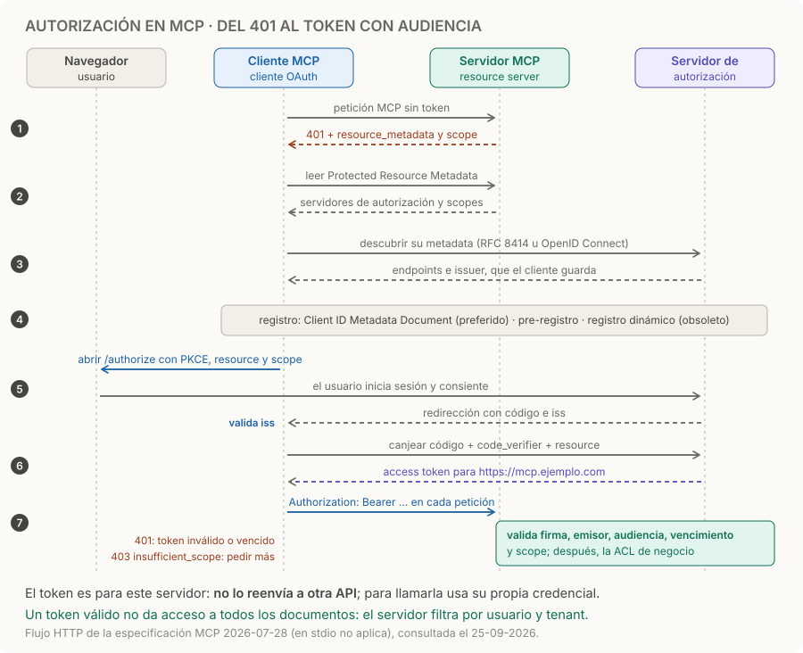

# Autenticación y autorización MCP

> **En una frase:** autenticación establece quién llama; autorización decide qué puede hacer y qué datos puede leer.

## Tres controles distintos

| Control | Ejemplo de soporte |
|---|---|
| Identidad | El access token identifica al usuario y a la aplicación cliente |
| Scope | `docs:read` permite usar el servicio de lectura |
| ACL de negocio | El usuario solo ve documentos de sus proyectos y tenant |

Un token válido no concede acceso a todos los documentos. Una aprobación en el host tampoco reemplaza la autorización del servidor.

## Conexión HTTP protegida



1. **401 con pistas.** Sin token, el servidor responde 401 con `WWW-Authenticate`, que incluye `resource_metadata` y, si corresponde, el `scope` necesario.
2. **Descubrimiento.** El servidor MCP debe publicar su Protected Resource Metadata (RFC 9728); de ahí el cliente saca qué servidor de autorización usar y después lee su metadata (RFC 8414 u OpenID Connect Discovery). El cliente guarda el `issuer` esperado.
3. **Registro del cliente.** Lo preferido es un Client ID Metadata Document: el `client_id` es una URL HTTPS con la metadata del cliente. También vale el pre-registro. El registro dinámico (RFC 7591) quedó obsoleto en 2026-07-28 y se mantiene por compatibilidad.
4. **Autorizar y canjear.** El cliente abre el navegador con PKCE, `scope` y `resource`, la URI canónica del servidor MCP. Valida el `iss` de la respuesta contra el emisor guardado antes de canjear el código, y vuelve a enviar `resource` al pedir el token.
5. **Usar el token.** Va en `Authorization: Bearer` en cada petición HTTP, nunca en la URL. El servidor debe comprobar que el token fue emitido para él como audiencia, y no puede aceptar ni reenviar otros tokens.

El proveedor de identidad hace el login, el servidor de autorización emite tokens y MCP actúa como **resource server**. Token inválido o vencido: 401. Scope insuficiente: 403 con `error="insufficient_scope"` y los scopes que faltan; el cliente vuelve a autorizar con la unión de los scopes que ya tenía y los nuevos, con un límite de reintentos. En stdio este flujo no aplica: las credenciales vienen del entorno. Las revisiones difieren en registro y endurecimiento del flujo; usá la especificación de la versión implementada. [Autorización actual](https://modelcontextprotocol.io/specification/2026-07-28/basic/authorization), [autorización 2025-11-25](https://modelcontextprotocol.io/specification/2025-11-25/basic/authorization).

## Implementación del lado servidor: laboratorio JWT

Este complemento para [[Construir un servidor MCP]] valida **access tokens JWT RS256** emitidos por un proveedor externo. No implementa el login, registro del cliente ni emisión de tokens. Para tokens opacos, usá introspección en lugar de decodificación JWT.

Guardá como `auth.py`. El contrato del proveedor debe incluir `sub`, `client_id` y `scope`; adaptalo explícitamente si utiliza otros claims. `ISSUER_URL`, `JWKS_URL` y `MCP_RESOURCE_URL` son configuración de confianza, nunca URLs tomadas del token.

```python
import asyncio
import os

import jwt
from mcp.server.auth.provider import AccessToken
from mcp.server.auth.settings import AuthSettings
from pydantic import AnyHttpUrl


def build_auth() -> dict:
    issuer = os.environ["ISSUER_URL"]
    audience = os.environ["MCP_RESOURCE_URL"]
    jwks_url = os.environ["JWKS_URL"]
    if not all(url.startswith("https://") for url in (issuer, audience, jwks_url)):
        raise ValueError("La configuración remota requiere HTTPS")
    jwks = jwt.PyJWKClient(jwks_url, timeout=5)

    class Verifier:
        async def verify_token(self, token: str) -> AccessToken | None:
            try:
                key = await asyncio.to_thread(jwks.get_signing_key_from_jwt, token)
                claims = jwt.decode(
                    token, key.key, algorithms=["RS256"],
                    issuer=issuer, audience=audience,
                    options={"require": ["exp", "iss", "aud", "sub", "client_id", "scope"]},
                )
                if not all(isinstance(claims[k], str) and claims[k]
                           for k in ("sub", "client_id", "scope")):
                    return None
                return AccessToken(
                    token=token, client_id=claims["client_id"],
                    subject=claims["sub"], claims=claims,
                    scopes=claims["scope"].split(),
                    expires_at=int(claims["exp"]), resource=audience,
                )
            except (jwt.PyJWTError, ValueError, TypeError, OSError):
                return None

    return {
        "token_verifier": Verifier(),
        "auth": AuthSettings(
            issuer_url=AnyHttpUrl(issuer),
            resource_server_url=AnyHttpUrl(audience),
            required_scopes=["docs:read"],
            validate_token_resource=True,
        ),
    }
```

En `server.py`, reemplazá la construcción de `mcp` por:

```python
from auth import build_auth

mcp = FastMCP(
    "Manual de soporte", stateless_http=True, json_response=True,
    **build_auth(),
)
```

Ejecutá con `uv run --with 'mcp==1.30.0' --with 'PyJWT[crypto]==2.15.0' python server.py --http`. Configurá las tres variables, los scopes y el recurso en tu proveedor; publicá mediante HTTPS y verificá que el proxy enrute también la metadata OAuth que genera el SDK. La validación del token y el wiring corresponden al SDK fijado del laboratorio. [SDK oficial](https://github.com/modelcontextprotocol/python-sdk/tree/v1.x).

Al exponer un dominio, configurá `TransportSecuritySettings` del SDK con una lista explícita de hosts y orígenes permitidos para ese despliegue. Los valores locales del ejemplo no aceptan automáticamente un dominio público; no desactives la protección contra DNS rebinding para resolverlo.

## Completar los permisos de negocio

El laboratorio protege todo el endpoint con `docs:read`; sus dos documentos son públicos dentro de la demo. Para documentos privados, obtené el principal desde `get_access_token()` de `mcp.server.auth.middleware.auth_context`, usá `subject` para resolver sus permisos y filtrá búsquedas y lecturas. No uses `client_id` como sustituto del usuario ni aceptes un usuario declarado en los argumentos de la tool.

Mantené separadas las credenciales **cliente → MCP** y **MCP → API externa**. El servidor debe validar la audiencia y no reenviar el bearer recibido a otra API. Los tokens y secretos tampoco deben entrar en prompts, argumentos del modelo o logs. En stdio, el flujo OAuth HTTP no aplica: el proceso recibe credenciales por un mecanismo local controlado. [Seguridad de MCP](https://modelcontextprotocol.io/docs/2026-07-28/tutorials/security/security_best_practices).

## Validación antes de usar datos privados

| Caso | Resultado esperado |
|---|---|
| Sin token, expirado, firma inválida, issuer o audience incorrectos | 401 |
| Token válido sin `docs:read` | 403 |
| Token válido y permiso de lectura | Llamada permitida |
| Documento de otro tenant, incluso por URI directa | Sin contenido no autorizado |
| Cache hit tras revocar un permiso | Revalidación, sin fuga de datos |
| Proveedor/JWKS no disponible | Denegar acceso y registrar diagnóstico sin token |

Un test con JWT firmado localmente prueba validación; el flujo OAuth completo necesita una prueba de integración con el proveedor y el host elegidos.

## Trampas
- **Token sin audiencia.** Si el servidor solo verifica la firma, acepta tokens emitidos para otra API del mismo proveedor. Validá `aud` contra tu URI canónica.
- **Reenviar el bearer.** Pasar el token recibido a una API externa convierte al servidor MCP en un intermediario confundido (*confused deputy*): usá una credencial propia para cada destino.
- **`client_id` como usuario.** Identifica la aplicación, no a la persona: los permisos salen de `subject`.
- **Pedir todos los scopes de entrada.** Pedí los del desafío o los mínimos de `scopes_supported` y ampliá cuando el servidor lo pida con 403.

> [!TIP] Para recordar
> **Identidad, scope y ACL son tres controles: el token dice quién y para qué servidor; la ACL decide qué documentos.**

## Practicá
> [!question]- Tu servidor MCP valida la firma y el vencimiento del JWT, pero no la audiencia. ¿Qué puede pasar?
> Que acepte un token emitido para otro recurso del mismo proveedor, por ejemplo una API interna que comparte el emisor. Quien tenga un token para ese recurso entra a tu servidor MCP con esos permisos. La especificación exige que el servidor compruebe que el token se emitió para él como audiencia (`resource`, RFC 8707). En el laboratorio lo hace `audience=MCP_RESOURCE_URL` junto con `validate_token_resource=True`.

> [!question]- Una tool de tu servidor necesita llamar a la API de CRM. ¿Puede usar el token que recibió del cliente?
> No. Ese token tiene como audiencia tu servidor MCP y la especificación prohíbe aceptar o reenviar otros tokens. Tu servidor llama al CRM con su propia credencial, obtenida para ese destino, y aplica los permisos del usuario (`subject`) antes de pedir o devolver datos. Mantené separadas las credenciales cliente → MCP y MCP → API externa.

> [!question]- Un usuario con token válido y scope `docs:read` intenta escribir y recibe 403. ¿Qué debería hacer el cliente?
> Leer el `WWW-Authenticate` del 403: `error="insufficient_scope"` y el `scope` que falta, por ejemplo `docs:write`. Si actúa en nombre del usuario, vuelve a autorizar pidiendo la unión de `docs:read` y `docs:write`, con consentimiento, y reintenta la operación pocas veces. Si el usuario no debería poder escribir, el servidor de autorización no emite ese scope y el 403 queda como respuesta final.

## Se conecta con

[[ACLs]] · [[Control humano y permisos]] · [[MCP stateless y estado]] · [[Seguridad y evidencia documental]]
