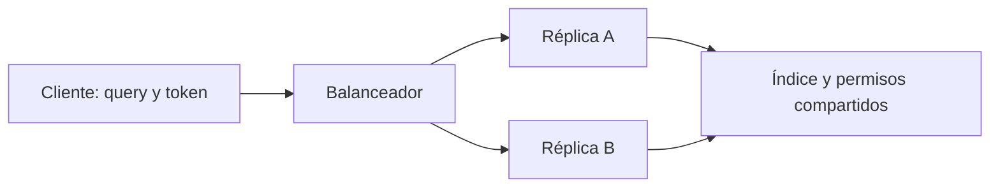

# MCP stateless y estado

> **En una frase:** cada petición contiene lo necesario para interpretarla; la aplicación puede seguir guardando documentos, memoria y trabajos.

## Cuatro estados diferentes

| Estado | Ejemplo | Dónde puede vivir |
|---|---|---|
| Protocolo | Versión, capacidades y antigua sesión | Metadatos por petición en la revisión actual |
| Conversación | Mensajes previos del usuario | Host o almacenamiento del agente |
| Negocio | Pedido, documento o trabajo de ingesta | Base de datos compartida |
| Autorización | Identidad y permisos | Token validado y políticas del servidor |

`2026-07-28` elimina las sesiones del protocolo HTTP. En `2025-11-25` podían existir; un servidor también podía operar sin ellas. Por eso `stateless_http=True` en un SDK anterior no demuestra soporte del protocolo nuevo. [Transportes actuales](https://modelcontextprotocol.io/specification/2026-07-28/basic/transports/streamable-http).

## Ejemplo de diseño

`buscar_documentos(query)` puede llegar a cualquier réplica. Una variable global `usuario_actual` o `ultima_busqueda` rompería ese aislamiento: otra petición podría usar datos ajenos.

Para trabajo duradero, devolvé un identificador opaco como `job_id` y guardá su estado fuera del proceso. Cada consulta debe verificar que el principal puede acceder a ese trabajo; conocer el identificador no autoriza nada.

## Trade-offs

- Facilita repartir carga y reemplazar procesos; agrega lecturas a almacenes compartidos.
- Requiere enviar contexto explícito; evitá adjuntar toda la conversación si solo hace falta una consulta.
- Los reintentos de operaciones con efectos necesitan idempotencia; stateless no evita duplicados.
- La caché debe separar tenant, permisos y versión de datos. Una respuesta cacheada tampoco salta la autorización.

**Prueba mental:** si reiniciás la réplica entre dos llamadas, ¿la segunda sigue funcionando y respeta los permisos? Si dependía de una variable local, identificá qué estado falta externalizar.

## Se conecta con

[[Ejecución y recuperación]] · [[Despliegue y operación bajo carga]] · [[Claves e invalidación de caché]] · [[Autenticación y autorización MCP]]
