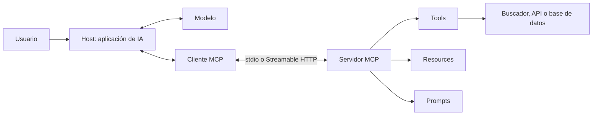

# MCP

> **En una frase:** Model Context Protocol estandariza cómo una aplicación de IA descubre y utiliza capacidades ofrecidas por otros programas.

## Las tres piezas que expone un servidor

| Pieza | Qué ofrece | Ejemplo documental |
|---|---|---|
| [[Tools en MCP\|Tool]] | Una operación con argumentos y resultado | `buscar_documentos(query, top_k)` |
| [[Resources en MCP\|Resource]] | Contenido identificado por una URI | `docs://manual/reembolsos` |
| [[Prompts en MCP\|Prompt]] | Una plantilla de mensajes parametrizada | `responder_con_fuentes(pregunta)` |

Una tool puede recuperar evidencia; el host decide cómo incorporarla a la conversación y generar una respuesta. Un servidor MCP puede funcionar sin tener un LLM propio.



## Orden de lectura

1. **Componentes:** [[Arquitectura MCP]] → [[Tools en MCP]], [[Resources en MCP]] y [[Prompts en MCP]]. Son capacidades complementarias, no etapas obligatorias.
2. **Conexión y estado:** [[Conexión y transportes MCP]] → [[MCP stateless y estado]].
3. **Implementación:** [[Construir un servidor MCP]] → [[RAG como tool MCP]] → [[Autenticación y autorización MCP]].

**Ejercicio conductor:** conectar un asistente a un manual de soporte; buscar fragmentos, leer un documento y preparar una respuesta con fuentes.

## Versiones de estos apuntes

La documentación consultada el **25 de septiembre de 2026** identifica `2026-07-28` como revisión vigente. Las notas de conexión comparan esa revisión con `2025-11-25`. El laboratorio usa **Python SDK `mcp==1.30.0`**, cuya versión de protocolo más reciente es `2025-11-25`; sus ejemplos están marcados como tales. La versión del paquete y la del protocolo son cosas distintas. [Versionado oficial](https://modelcontextprotocol.io/docs/2026-07-28/learn/versioning).

## Conexiones con otras categorías

- **Fundamentos:** [[Tools y function calling]] explica cómo el modelo propone una acción.
- **RAG:** [[RAG agéntico]] explica cuándo buscar de nuevo; MCP expone el buscador.
- **Seguridad:** [[ACLs]] y [[Control humano y permisos]] definen el acceso permitido.
- **Runtime:** [[Ejecución y recuperación]], [[Trazas y debugging]] y [[Caché de ingesta y búsqueda]].
- **Evals:** [[Tool evals]] mide selección y argumentos; [[RAG evals]] mide recuperación y evidencia.

## Estado de los nodos

```dataview
TABLE WITHOUT ID file.link AS nodo, bloque, estado
FROM "mcp" WHERE tipo != "mapa" SORT orden
```

[[MCP.canvas|Abrir el canvas de MCP]]
