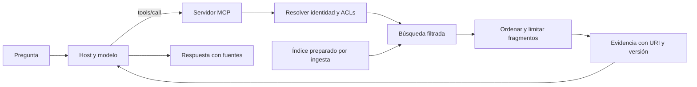

# RAG como tool MCP

> **En una frase:** exponé la recuperación como una tool que devuelve evidencia autorizada; el host puede usarla para generar la respuesta.

## Dónde encaja



**Decisión de este diseño:** la tool `buscar_documentos` hace retrieval. La generación queda en el host. También podés exponer `responder_pregunta` con RAG completo dentro del servidor, pero eso suma modelo, costo y políticas al backend y vuelve menos visible la evidencia intermedia.

## Pasar del laboratorio a un buscador real

1. Prepará fuentes con el pipeline de [[RAG]]; la ingesta corre aparte.
2. Reemplazá la coincidencia de palabras del ejemplo por [[Búsqueda híbrida y reranking]] o el mecanismo que tus evals justifiquen.
3. Derivá usuario y tenant del contexto autenticado. Un `tenant_id` propuesto por el modelo nunca basta para autorizar.
4. Aplicá ACLs en la recuperación antes de entregar candidatos a servicios externos o al modelo. Revalidá también al leer por URI.
5. Devolvé pocos fragmentos con identificadores, localización y versión. Si no hay evidencia, devolvé vacío.

MCP admite resultados estructurados y enlaces a resources; no obliga a usar una base vectorial. [Resultados de tools](https://modelcontextprotocol.io/specification/2026-07-28/server/tools).

## Contrato de evidencia propuesto

```json
{
  "hits": [{
    "document_id": "politica-42",
    "chunk_id": "politica-42-seccion-3",
    "uri": "docs://manual/politica-42",
    "fragmento": "El trámite requiere el número de pedido.",
    "version": "2026-09-01",
    "ubicacion": "Sección 3"
  }]
}
```

Un score de recuperación puede ayudar a ordenar, pero no representa una probabilidad de que la respuesta sea verdadera. El contenido recuperado sigue siendo datos de una fuente: no puede autorizar tools ni reemplazar instrucciones del host.

## Qué evaluar

| Capa | Caso |
|---|---|
| Tool | El agente busca cuando necesita evidencia y usa argumentos válidos |
| Retrieval | Recupera el fragmento correcto entre documentos similares |
| Permisos | Otro tenant no aparece en resultados, recursos ni caché |
| Respuesta | Las afirmaciones están respaldadas y las citas existen |
| Operación | Backend caído, sin resultados, latencia y datos desactualizados |

## Se conecta con

[[RAG agéntico]] · [[ACLs]] · [[Caché de ingesta y búsqueda]] · [[RAG evals]] · [[Tool evals]]
