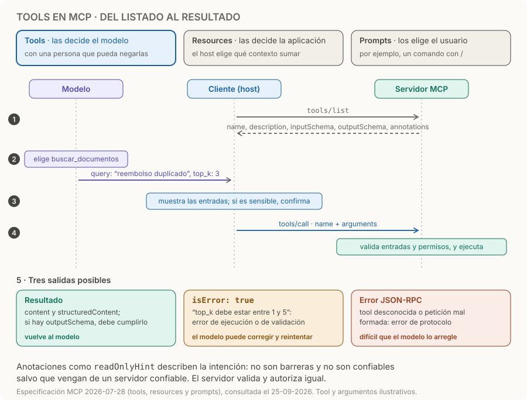

# Tools en MCP

> **En una frase:** una tool ejecuta una operación acotada: buscar información, calcular o modificar un sistema.

## Contrato
1. **Listar.** El cliente pide `tools/list` y recibe las definiciones: `name`, `description`, `inputSchema` (JSON Schema), y opcionalmente `title`, `outputSchema` y `annotations`. El servidor debería devolverlas en un orden estable, lo que ayuda a la caché de prompts, y la lista puede variar según los scopes del token, pero no según la conexión.
2. **Elegir.** El modelo decide qué tool usar y con qué argumentos.
3. **Confirmar.** El host muestra qué tools están expuestas y cuándo se invocan; para operaciones sensibles, pide confirmación.
4. **Llamar.** `tools/call` con `name` y `arguments`. El servidor valida las entradas, controla el acceso, limita la tasa de llamadas y ejecuta.
5. **Devolver.** El resultado trae `content` (texto, imagen, audio o enlaces a resources) y, si corresponde, `structuredContent`. Si la tool declaró `outputSchema`, el resultado estructurado debe cumplirlo, y conviene repetirlo serializado como texto por compatibilidad. [Especificación de tools](https://modelcontextprotocol.io/specification/2026-07-28/server/tools).

**Diseño del ejemplo:**

| Parte | Decisión |
|---|---|
| Nombre | `buscar_documentos` |
| Descripción | Buscar fragmentos del manual para fundamentar respuestas |
| Entradas | `query`: texto no vacío; `top_k`: entero entre 1 y 5 |
| Salida | Lista de `document_id`, `uri`, `fragmento` y `version` |
| Efectos | Solo lectura; no cambia documentos |
| Vacío | `hits: []` significa que no se encontró evidencia |

## Quién decide usarla
Las tools están pensadas para ser **controladas por el modelo**: él propone la llamada. Los resources, en cambio, los decide la aplicación, y los prompts los elige el usuario: [[Resources en MCP]] y [[Prompts en MCP]]. La especificación recomienda que siempre haya una persona capaz de negar una invocación; el host puede impedirla o pedir aprobación, y el servidor vuelve a autorizarla. Las anotaciones como `readOnlyHint` describen intención, no son barreras de seguridad, y el cliente debe tratarlas como no confiables salvo que vengan de un servidor confiable.

## Errores que conviene distinguir
| Tipo | Ejemplos | Cómo llega | Quién lo resuelve |
|---|---|---|---|
| Transporte o autenticación | No conecta, token inválido | HTTP 401/403 o falla de conexión | La aplicación: [[Autenticación y autorización MCP]] |
| Protocolo | Tool desconocida, petición mal formada, error del servidor | Error JSON-RPC | Difícilmente el modelo |
| Ejecución | Falla de una API, argumento fuera de rango, regla de negocio | Resultado con `isError: true` | El modelo, que puede corregir y reintentar |
| Sin resultados | Búsqueda válida sin coincidencias | Resultado normal, por ejemplo `hits: []` | No es un error |

El cliente debería pasarle al modelo los errores de ejecución, para que se corrija; los de protocolo rara vez le sirven.

**Ejemplo de diseño propio:** separar `consultar_reembolso` de `aprobar_reembolso` permite darles permisos diferentes. Una tool enorme llamada `hacer_cualquier_cosa` dificulta validación y evaluación.

## Trampas
- **Confiar en las anotaciones.** Un `readOnlyHint: true` de un servidor desconocido no prueba nada: la confirmación y los permisos se deciden igual.
- **Validación como error de protocolo.** Si un argumento fuera de rango vuelve como error JSON-RPC, el modelo no ve el mensaje y no puede corregirse: devolvelo con `isError: true` y un texto accionable.
- **Vacío que parece error, o error que parece vacío.** “No encontré nada” y “no pude buscar” son respuestas distintas.
- **Estado implícito entre llamadas.** MCP no tiene sesión de protocolo: si una tool necesita estado, devolvé un identificador explícito y validá los permisos en cada llamada: [[MCP stateless y estado]].
- **Nombres repetidos.** Dos servidores pueden exponer `search`; el cliente que los junta tiene que distinguirlos, por ejemplo con un prefijo por servidor.

> [!TIP] Para recordar
> **El modelo propone, el host confirma, el servidor valida y autoriza; los errores de ejecución vuelven al modelo con `isError`.**

## Practicá
> [!question]- El modelo llama a `buscar_documentos` con `top_k: 50` y tu servidor responde con un error JSON-RPC -32602. ¿Qué cambiarías?
> Devolvelo como error de ejecución: un resultado con `isError: true` y un texto accionable, como “top_k debe estar entre 1 y 5”. Así el cliente se lo pasa al modelo y este puede reintentar con un valor válido. Los errores JSON-RPC quedan para lo que el modelo no puede arreglar: una tool que no existe o una petición mal formada.

> [!question]- Un servidor MCP de terceros marca su tool `borrar_registros` con `readOnlyHint: true`. ¿Qué hace el host?
> No le cree. Las anotaciones de un servidor no confiable son solo descripciones y pueden estar equivocadas o ser maliciosas. El host decide la confirmación por el nombre, la descripción y lo que la tool puede hacer, muestra las entradas antes de llamar y deja que una persona lo niegue. El servidor, por su lado, tiene que validar y autorizar igual: [[Control humano y permisos]].

> [!question]- ¿Cuándo declararías un `outputSchema` para una tool?
> Cuando otro sistema o el modelo necesita leer campos concretos del resultado, como `document_id`, `uri` y `version` en `buscar_documentos`. Con el esquema declarado, el servidor debe devolver `structuredContent` que lo cumpla y el cliente puede validarlo antes de pasárselo al modelo. Para respuestas que son solo texto para leer, no hace falta.

## Se conecta con
[[RAG como tool MCP]] · [[Construir un servidor MCP]] · [[Control humano y permisos]] · [[Tool evals]] · [[Resources en MCP]] · [[Prompts en MCP]]
