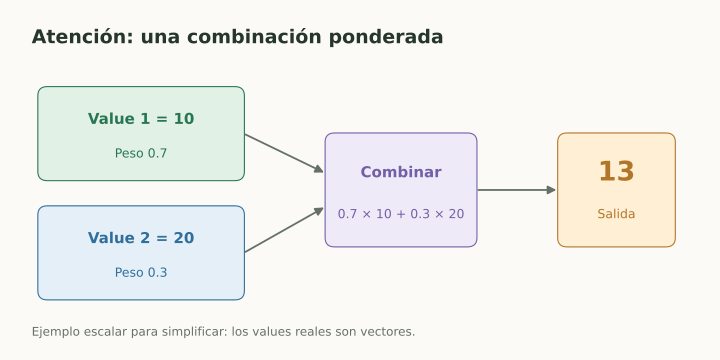
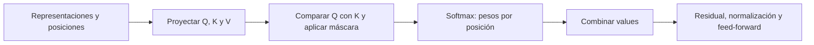

# Attention y Transformers

> **En una frase:** atención combina representaciones según su relación con la consulta de cada posición.

## Vista rápida

- Queries y keys producen pesos que combinan los values.
- Los pesos de atención no indican si una afirmación es verdadera.

## Queries, keys y values
Una representación $X$ se proyecta a $Q=XW_Q$, $K=XW_K$ y $V=XW_V$:

$$
\operatorname{Attention}(Q,K,V)
=\operatorname{softmax}\left(\frac{QK^\top}{\sqrt{d_k}}+M\right)V.
$$

$d_k$ es la dimensión de keys. $M$ es una máscara: puede impedir ver posiciones futuras. Softmax se aplica por fila.

**Q:** qué busca una posición. **K:** con qué se compara. **V:** qué información se combina.

Ejemplo simplificado: una posición asigna pesos de atención $[0.7,0.3]$ a dos values. La salida es $0.7V_1+0.3V_2$. Los pesos suman uno; no son probabilidades de que los textos sean verdaderos.

## Un bloque Transformer
Combina atención con redes feed-forward, conexiones residuales y normalización. Varias cabezas permiten aprender combinaciones distintas. El modelo necesita información de posición.

**Encoder:** representaciones del texto observado. **Decoder causal:** predice usando posiciones anteriores. **Encoder-decoder:** genera condicionado en representaciones de otra secuencia.

## En Gen AI
Muchos LLMs de texto usan decoders causales. En entrenamiento pueden evaluarse muchas posiciones en paralelo con máscara; en generación autoregresiva los nuevos tokens dependen de los anteriores.

La atención no sustituye un buscador externo y sus pesos no constituyen una explicación completa de la decisión. Más contexto disponible no garantiza usar toda la evidencia.

## Flujo del concepto

## Se conecta con
[[Objetivos de lenguaje y perplexity]] · [[Contexto, memoria y estado]] · [[Lost in the middle]]

## Fuentes
- [Vaswani et al. · Attention Is All You Need](https://arxiv.org/html/1706.03762v7)
