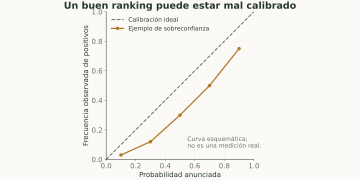
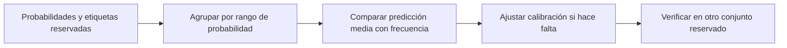

# Calibración y confianza

> **En una frase:** estar calibrado significa que las probabilidades anunciadas concuerdan con las frecuencias observadas.

## Vista rápida

- Si p = 0.8 está calibrado, cerca del 80% de esos casos son positivos.
- Un buen ranking puede anunciar probabilidades incorrectas.

## Ejemplo
Entre 100 casos donde un clasificador anuncia $p\approx0.8$, esperaríamos aproximadamente 80 positivos si está bien calibrado. No exige que cada caso individual sea “80% correcto”.

Un modelo puede ordenar muy bien los casos y tener ROC-AUC alto, pero asignar probabilidades demasiado extremas.

## Cómo medir
**Reliability diagram:** agrupar predicciones por rangos de probabilidad y comparar media predicha con fracción de positivos.

**Brier score binario:**

$$
\frac1n\sum_i(p_i-y_i)^2.
$$

Menor es mejor, pero combina calibración y capacidad predictiva; no aísla calibración. Log loss también penaliza probabilidades equivocadas.

**ECE** resume diferencias entre bins; cambia con el número de bins y la muestra, así que no lo interpretes sin ese contexto.

## Cómo corregir
Métodos como calibración sigmoidal o isotónica ajustan probabilidades usando datos independientes del ajuste del modelo. Evaluá la calibración resultante en datos reservados.

## En Gen AI
“Estoy 90% seguro” en texto no es una probabilidad calibrada. Un coseno 0.9 tampoco. La probabilidad de un token estima ese token bajo el modelo, no la veracidad de una afirmación.

Para abstención, definí una señal de riesgo y comprobá su relación con errores humanos etiquetados. La [[Calibración de evaluadores]] verifica concordancia de jueces y rúbricas; es un problema relacionado, pero diferente.

## Flujo del concepto

## Se conecta con
[[Umbrales y costo de errores]] · [[Objetivos de lenguaje y perplexity]] · [[Guardrails]]

## Fuentes
- [scikit-learn · calibración](https://scikit-learn.org/stable/modules/calibration.html)
