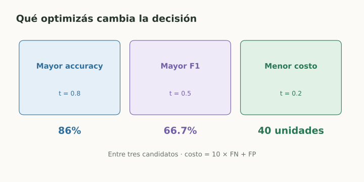

# Caso práctico - Métricas de un router Gen AI

> **En una frase:** evaluá el score, elegí una decisión en validation y medí el resultado final con un test reservado.

## Vista rápida



- Mayor accuracy, mayor F1 y menor costo eligen umbrales diferentes.
- Los scores del ejemplo son sintéticos, no probabilidades calibradas.

## Caso didáctico
Un router decide si una consulta necesita humano. **Positivo = necesita derivación**. Usamos 100 ejemplos sintéticos: 20 positivos y 80 negativos.

Los scores de este ejemplo son inventados para calcular métricas; no provienen de un modelo entrenado y no representan probabilidades calibradas.

## 1. Calcular con Python
Requiere NumPy y scikit-learn. Los grupos de scores producen los conteos usados en las notas anteriores.

```python
import numpy as np
from sklearn.metrics import (
    confusion_matrix, accuracy_score, precision_score, recall_score,
    f1_score, roc_auc_score, average_precision_score,
)

# Positivos: 8 muy altos, 7 medios, 4 bajos y 1 muy bajo.
# Negativos: 2 muy altos, 8 medios, 20 bajos y 50 muy bajos.
y = np.array([1] * 20 + [0] * 80)
scores = np.array(
    [0.9] * 8 + [0.6] * 7 + [0.3] * 4 + [0.1]
    + [0.9] * 2 + [0.6] * 8 + [0.3] * 20 + [0.1] * 50
)

for t in [0.8, 0.5, 0.2]:
    pred = (scores >= t).astype(int)
    tn, fp, fn, tp = confusion_matrix(y, pred, labels=[0, 1]).ravel()
    print(
        f"t={t}: TP={tp}, FP={fp}, FN={fn}, TN={tn}; "
        f"accuracy={accuracy_score(y, pred):.3f}, "
        f"precision={precision_score(y, pred):.3f}, "
        f"recall={recall_score(y, pred):.3f}, "
        f"F1={f1_score(y, pred):.3f}, costo={10 * fn + fp}"
    )

# Las áreas usan scores, no las etiquetas de un umbral.
print(f"ROC-AUC={roc_auc_score(y, scores):.6f}")
print(f"AP={average_precision_score(y, scores):.5f}")
```

## 2. Interpretar la salida
| Umbral | Accuracy | Precision | Recall | F1 | Costo $10FN+FP$ |
|---|---|---|---|---|---|
| 0.8 | 86% | 80% | 40% | 53.3% | 122 |
| 0.5 | 85% | 60% | 75% | 66.7% | 60 |
| 0.2 | 69% | 38.8% | 95% | 55.1% | 40 |

**ROC-AUC = 0.884375** y **AP ≈ 0.61755** son iguales para las tres decisiones porque usamos el mismo ranking de scores.

Maximizar accuracy elegiría 0.8 entre estos candidatos; maximizar F1 elegiría 0.5; minimizar el costo propuesto elegiría 0.2. La política de producto determina qué optimizar.

## 3. Llevarlo a datos reales
Construí etiquetas humanas con una rúbrica; separá por conversación o usuario. Aprendé el score con train, elegí umbral con validation y reportá test al cerrar las decisiones.

Incluí carga humana, segmentos y casos raros. Un LLM que declara “confianza 0.9” no proporciona automáticamente el score que este procedimiento necesita.

## Para comprobar que entendiste
1. Si duplicamos negativos manteniendo TPR y FPR, ¿qué pasa con precision? **Baja**, si la cantidad de positivos sigue igual.
2. ¿ROC-AUC 0.884375 significa 88.4375% de respuestas correctas? **No:** mide ordenación entre positivos y negativos.
3. ¿Usamos este dataset para elegir y reportar calidad real? **No:** es sintético y didáctico; desarrollo y test deben separarse en una evaluación real.

## Se conecta con
[[ML para Gen AI]] · [[Caso práctico - Asistente de soporte]] · [[Router handoff]] · [[Golden dataset]]

## Fuentes
- [scikit-learn · métricas](https://scikit-learn.org/stable/api/sklearn.metrics.html)
