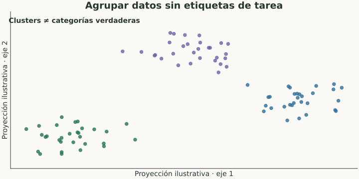

# Clustering y reducción de dimensionalidad

> **En una frase:** agrupar y comprimir datos ayuda a explorarlos; no demuestra que el sistema resuelva una tarea.

## Vista rápida

- Los clusters descubren estructura; sus nombres los interpretamos.
- Una proyección en 2D no demuestra desempeño en la tarea.

## Agrupar sin labels
**Clustering** reúne ejemplos por similitud. K-means alterna asignar puntos al centro más cercano y recalcular centros, buscando reducir distancias cuadradas dentro de cada grupo. Tenés que elegir $k$.

**DBSCAN** busca zonas densas y puede dejar puntos como ruido; depende de la escala y de sus parámetros. Un cluster no es automáticamente una categoría real.

**Ejemplo Gen AI:** agrupar embeddings de consultas descubre temas frecuentes. Revisá muestras de cada grupo y poné nombres después de inspeccionarlas; no asumas que un grupo es “fraude” solo por su distancia.

## Reducir dimensiones
**PCA** encuentra direcciones lineales que conservan mucha varianza. Puede comprimir features o facilitar exploración; varianza alta no significa relevancia alta para la tarea.

t-SNE y UMAP se usan para visualizar vecindarios en pocas dimensiones. Un dibujo con islas separadas no prueba separación útil en el espacio original; la proyección cambia distancias y estructura.

## Cómo evaluar
La silueta resume separación y cohesión según una distancia. Si tenés etiquetas externas, podés contrastar agrupaciones con ellas. Para un producto, además medí si el agrupamiento mejora una decisión.

Ajustá PCA y transformaciones con train si se usarán en un modelo evaluado. Una reducción que mejora velocidad puede perder información relevante.

## Se conecta con
[[Embeddings y aprendizaje de representaciones]] · [[Modelos de embedding]] · [[Golden dataset]] · [[Experimentos e incertidumbre]]

## Fuentes
- [scikit-learn · clustering](https://scikit-learn.org/stable/modules/clustering.html)
- [scikit-learn · PCA](https://scikit-learn.org/stable/modules/decomposition.html)
