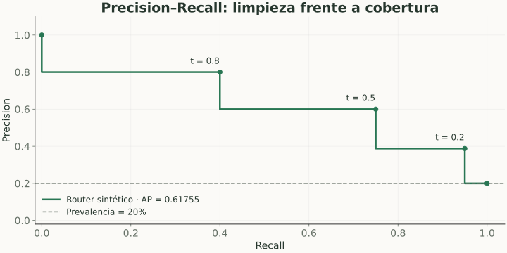

# Curva Precision-Recall y Average Precision

> **En una frase:** la curva PR muestra cuán limpias son las detecciones para distintos niveles de cobertura.

## Vista rápida

- PR compara precision y recall; mirá la prevalencia.
- AP resume la curva ponderando incrementos de recall.

## Cómo leerla
**X:** recall. **Y:** precision. Cada umbral cambia cuántos casos seleccionamos. Hacia arriba y a la derecha es mejor.

En el ejemplo del router:

| Umbral | Recall | Precision |
|---|---|---|
| 0.8 | 40% | 80% |
| 0.5 | 75% | 60% |
| 0.2 | 95% | 38.8% |

Con prevalencia 20%, un ranking aleatorio tiene una referencia de precision cercana a 20%. Es una referencia poblacional, no el valor exacto de AP de cualquier muestra aleatoria pequeña.

## Resumir la curva
**Average Precision (AP)** pondera precision por incrementos de recall:

$$
AP=\sum_n (R_n-R_{n-1})P_n,
$$

con puntos ordenados por recall creciente. En scikit-learn no usa interpolación trapezoidal. “PR-AUC” puede referirse a otra integración: declará el método si lo usás.

## Por qué sirve con desbalance
Precision incorpora directamente cuánto trabajo seleccionado fue correcto. Dos evaluaciones con prevalencias distintas pueden tener precision y AP diferentes aun con comportamiento condicional parecido.

Compará sobre el mismo dataset y reportá la tasa de positivos. Para decidir, inspeccioná además precision al recall requerido y el número de alertas.

## En Gen AI
Útil para detectores de respuestas problemáticas o abstención, cuando existe una rúbrica binaria y un score. No reemplaza evaluar la generación.

## Se conecta con
[[Curvas ROC y AUC]] · [[Desbalance y calidad de etiquetas]] · [[Calibración y confianza]]

## Fuentes
- [scikit-learn · curva PR](https://scikit-learn.org/stable/modules/generated/sklearn.metrics.precision_recall_curve.html)
- [scikit-learn · Average Precision](https://scikit-learn.org/stable/modules/generated/sklearn.metrics.average_precision_score.html)
