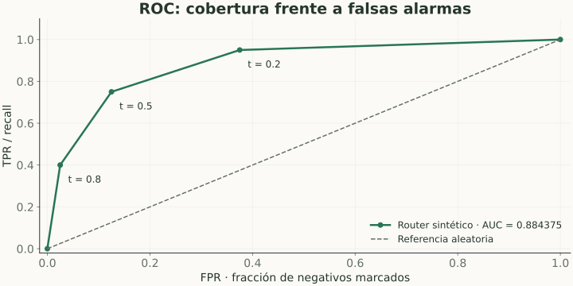

# Curvas ROC y AUC

> **En una frase:** ROC muestra el intercambio entre detectar positivos y activar falsas alarmas al variar el umbral.

## Vista rápida

- ROC compara TPR y FPR al variar el umbral.
- AUC mide el ranking; no es porcentaje de respuestas correctas.

## Los ejes
$$
\text{TPR}=\text{recall}=\frac{TP}{TP+FN},
\qquad
\text{FPR}=\frac{FP}{FP+TN}.
$$

**X:** FPR. **Y:** TPR. Cada punto corresponde a un umbral. Arriba a la izquierda es mejor: muchos positivos detectados y pocas falsas alarmas.

## Ejemplo compartido
| Umbral | FPR | TPR / recall |
|---|---|---|
| 0.8 | 2/80 = 2.5% | 8/20 = 40% |
| 0.5 | 10/80 = 12.5% | 15/20 = 75% |
| 0.2 | 30/80 = 37.5% | 19/20 = 95% |

La diagonal representa el comportamiento esperado de un ranking aleatorio.

## Qué significa AUC
**ROC-AUC** es el área bajo la curva completa: 1 para separación perfecta, alrededor de 0.5 para ranking aleatorio. Equivale a la probabilidad de que un positivo tenga mayor score que un negativo, contando empates como medio acierto.

No es accuracy, ni porcentaje de respuestas correctas, ni un umbral recomendado. Debe calcularse con scores, no solo etiquetas binarias.

## Límite con clases raras
Una FPR pequeña puede producir muchas alertas si abundan los negativos. Mirá también precision, la curva PR y el punto que realmente vas a usar. El gráfico muestra el ejemplo didáctico completo del caso práctico.

## Se conecta con
[[Curva Precision-Recall y Average Precision]] · [[Desbalance y calidad de etiquetas]] · [[Caso práctico - Métricas de un router Gen AI]]

## Fuentes
- [Google · ROC y AUC](https://developers.google.com/machine-learning/crash-course/classification/roc-and-auc)
