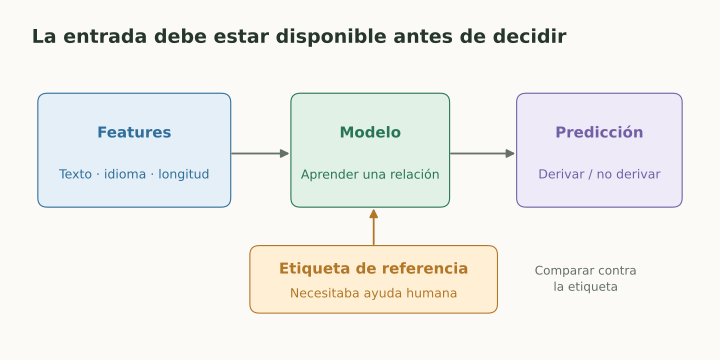
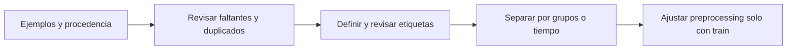

# Datos, features y etiquetas

> **En una frase:** el modelo aprende de la representación y de las etiquetas que le das, incluidos sus errores.

## Vista rápida

- Las features deben existir antes de tomar la decisión.
- Una etiqueta ambigua enseña una tarea ambigua.

## Qué contiene un dataset
Cada fila debe tener una unidad clara: consulta, conversación, documento o usuario. Guardá entradas, etiqueta, procedencia y fecha; en un sistema generativo, también referencia y criterio de evaluación.

**Features:** texto, embedding, idioma, longitud, score de recuperación. **Etiqueta:** escalación necesaria, relevancia de un pasaje, respuesta aceptable. La etiqueta debe definir qué significa éxito y quién lo determinó.

## Preparación habitual
| Operación | Para qué sirve | Cuidado |
|---|---|---|
| Imputación | Manejar datos faltantes | “Faltante” puede tener significado |
| Estandarización $z=(x-\mu)/\sigma$ | Poner features numéricas en escalas comparables | Aprender $\mu,\sigma$ solo con train |
| One-hot | Representar categorías sin orden | No inventar orden con IDs numéricos |
| Embeddings | Representar relaciones aprendidas | Evaluar idioma y dominio |
| Deduplicación | Evitar repetición accidental | Separar duplicados antes de evaluar |

**Ejemplo:** para un router, “urgencia” anotada por personas puede ser una feature válida si existe antes de decidir. “Fue escalado finalmente” puede ser el target; usarlo como entrada filtraría la respuesta.

## En Gen AI
Un documento recuperable no es automáticamente un buen ejemplo de fine-tuning. Un label creado por un juez LLM puede ser ruidoso: usá una rúbrica y revisá desacuerdos con humanos.

No elimines puntuación, mayúsculas o estructura de textos sin probar el impacto: pueden cambiar el significado.

## Flujo del concepto

## Se conecta con
[[Train, validation, test y leakage]] · [[Golden dataset]] · [[Deduplication]] · [[Normalization]]

## Fuentes
- [scikit-learn · preprocessing](https://scikit-learn.org/stable/modules/preprocessing.html)
