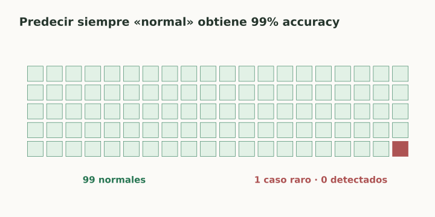

# Desbalance y calidad de etiquetas

> **En una frase:** cuando una clase es rara, el promedio puede esconder que el modelo nunca la detecta.

## Vista rápida

- La clase mayoritaria puede esconder el fallo de la clase rara.
- Medí por clase y evaluá con tráfico representativo.

## Ejemplo
Hay 990 consultas normales y 10 que necesitan derivación. Predecir “normal” siempre obtiene **99% accuracy** y **0% recall** de derivación.

Primero definí qué error cuesta más. Después medí por clase, idioma, cliente y dificultad; informá el número de casos en cada grupo.

## Herramientas y límites
| Acción | Qué cambia |
|---|---|
| Pesos de clase en la loss | Penaliza más errores de una clase |
| Oversampling / undersampling de train | Cambia la frecuencia de ejemplos vistos |
| Ajustar el umbral | Cambia la decisión sobre un score |
| Recolectar casos raros reales | Mejora cobertura y permite evaluar |

Hacé resampling únicamente dentro de train o del fold de entrenamiento. Evaluá sobre una distribución representativa del uso real; si balanceás el test artificialmente, aclaralo y no tomes su precision como la de producción.

## La etiqueta también falla
Una rúbrica ambigua genera desacuerdo. Revisá una muestra con varios anotadores, discutí casos límite y versioná las etiquetas. “No documentado” no equivale siempre a negativo.

**En Gen AI:** las respuestas alucinadas pueden ser raras en un benchmark fácil. Sumá casos difíciles para diagnóstico y mantené otra evaluación representativa para estimar su frecuencia real.

## Se conecta con
[[Precision y recall]] · [[Curva Precision-Recall y Average Precision]] · [[Calibración de evaluadores]] · [[Golden dataset]]

## Fuentes
- [Google · datasets desbalanceados](https://developers.google.com/machine-learning/crash-course/overfitting/imbalanced-datasets)
