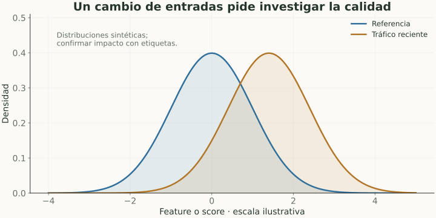

# Distribución, drift y monitoreo

> **En una frase:** un modelo puede seguir ejecutándose correctamente mientras los datos cambian y su calidad cae.

## Vista rápida

- Un cambio de distribución no prueba por sí solo una caída de calidad.
- Confirmá con etiquetas, segmentos y versiones del pipeline.

## Qué puede cambiar
| Cambio | Significado | Ejemplo Gen AI |
|---|---|---|
| Data / covariate drift | Cambia $P(X)$ | Más consultas en otro idioma |
| Label shift | Cambia $P(Y)$ | Aumentan las consultas que requieren humano |
| Concept drift | Cambia la relación $P(Y\mid X)$ | Una política nueva cambia qué respuesta es válida |
| Training-serving skew | Diferencia entre preparación en train y en servicio | Otra versión de tokenizer o features |

Una caída por un documento eliminado o una tool rota puede ser un incidente de software, además o en lugar de drift.

## Qué monitorear
Distribuciones de entradas y scores, etiquetas cuando lleguen, métricas por segmento, abstención, referencias documentales, errores y costo por tarea resuelta.

**Ejemplo:** si duplican las consultas que requieren derivación, puede cambiar precision aun con las mismas TPR y FPR. Si cambiás el embedding, también puede cambiar la distribución de similitud: recalibrá reglas con evidencia.

## Detectar no equivale a solucionar
Un cambio de entrada no demuestra caída de calidad. Confirmá con casos etiquetados, revisá el pipeline y localizá la causa antes de reentrenar.

Conservá referencias de versiones para saber si cambió el modelo, corpus, prompt o grader. Agregá casos nuevos al conjunto de desarrollo sin contaminar el test cerrado.

## En Gen AI
Los cambios de proveedor, retrieval y fuentes pueden afectar el sistema completo. Usá las bases de ML para interpretar lo observado y las notas de Runtime para operar la respuesta.

## Se conecta con
[[Operación en producción]] · [[Evals por cliente y producción]] · [[Trazas y debugging]] · [[Incremental sync]]

## Fuentes
- [Google · monitoreo de ML](https://developers.google.com/machine-learning/crash-course/production-ml-systems/monitoring)
