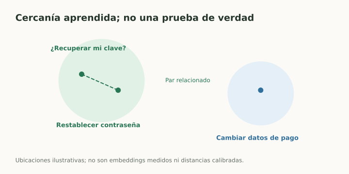

# Embeddings y aprendizaje de representaciones

> **En una frase:** un embedding representa objetos mediante vectores cuya geometría se aprende para algún objetivo.

## Vista rápida

- Pares relacionados pueden aprender a quedar cerca.
- Similitud temática no garantiza evidencia ni acuerdo factual.

## Encoding no es lo mismo que embedding
One-hot asigna una posición distinta a cada categoría: todos los pares distintos quedan igualmente separados. Un embedding denso puede representar relaciones aprendidas.

Un **embedding de token** es parte de la entrada de un modelo. Una **representación contextual** cambia según el contexto. Un **embedding de documento** resume texto para una tarea como recuperación.

## Cómo se aprende
Un objetivo de predicción aprende representaciones útiles para predecir targets. Un objetivo **contrastivo** acerca pares relacionados y aleja pares negativos según una función de pérdida.

**Ejemplo Gen AI:** consulta “¿cómo recuperar mi clave?” y pasaje sobre restablecer contraseña forman un par positivo. Un pasaje sobre facturación es negativo. Un negativo difícil puede hablar de claves, pero no resolver esa pregunta.

## Qué no se puede asumir
Que dos textos queden cerca no demuestra que uno respalde al otro. Puede haber similitud temática y contradicción.

La distancia depende del modelo, entrenamiento y métrica. Embeddings de versiones distintas no son automáticamente comparables; cambiar el modelo puede exigir reindexar todo el corpus.

## Aplicación
Usá representaciones para búsqueda, clasificación, clustering o deduplicación, y evaluá cada tarea con sus métricas.

Un dibujo en dos dimensiones puede ayudar a explorar, pero no valida un índice de cientos de dimensiones.

## Se conecta con
[[Modelos de embedding]] · [[Bi-encoder]] · [[Cross-encoder]] · [[Métricas de ranking y recuperación]] · [[Clustering y reducción de dimensionalidad]]

## Fuentes
- [Google · embeddings](https://developers.google.com/machine-learning/crash-course/embeddings)
