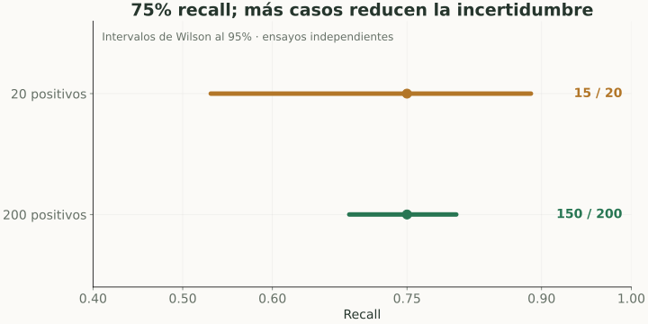
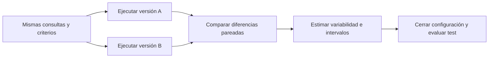

# Experimentos e incertidumbre

> **En una frase:** una mejora medida en pocos casos puede ser ruido; compará versiones con datos y criterios controlados.

## Vista rápida

- 15/20 y 150/200 tienen el mismo recall, pero distinta incertidumbre.
- Compará versiones sobre las mismas consultas y reservá test.

## Un experimento útil
Definí antes el cambio, la métrica principal, los casos, el criterio de aceptación y las restricciones de costo y latencia.

Compará A y B sobre las **mismas consultas** para poder analizar diferencias pareadas. Versioná dataset, prompt, modelo, retrieval y grader; fijá lo que puedas y registrá lo que no.

## Tamaño de muestra
Detectar 15 de 20 positivos y 150 de 200 da recall 75% en ambos casos, pero distinta incertidumbre.

Como aproximación para una proporción $\hat p$ con $n$ ensayos independientes:

$$
SE\approx\sqrt{\frac{\hat p(1-\hat p)}n}.
$$

Para recall 0.75: $SE\approx0.097$ con 20 positivos, y $0.031$ con 200. Los intervalos normales fallan con muestras pequeñas o proporciones extremas; usá un método adecuado.

La imagen usa [intervalos de Wilson al 95%](https://www.itl.nist.gov/div898/handbook/prc/section2/prc241.htm), bajo el supuesto de casos independientes. Con más positivos evaluados, el intervalo se estrecha.

## Bootstrap y comparación
Bootstrap remuestrea unidades para estimar variabilidad y construir intervalos. Para comparar versiones, remuestreá pares A/B; para conversaciones relacionadas, remuestreá por grupos. Elegí un método que respete la dependencia de los datos.

No interpretar un intervalo frecuente de 95% como “95% de probabilidad de que el parámetro esté en este intervalo observado”.

## En Gen AI
El sampling y los jueces pueden variar: repetí ejecuciones cuando esa variabilidad sea relevante. Un A/B en producción requiere asignación controlada y métricas operativas.

Elegir el ganador tras probar muchos cambios aumenta el riesgo de sobreajuste al benchmark. Cerrá la configuración antes del test final.

## Flujo del concepto

## Se conecta con
[[Golden dataset]] · [[Calibración de evaluadores]] · [[Evals por cliente y producción]] · [[Regresiones y CI]]

## Fuentes
- [SciPy · bootstrap](https://docs.scipy.org/doc/scipy/reference/generated/scipy.stats.bootstrap.html)
- [scikit-learn · cross-validation](https://scikit-learn.org/stable/modules/cross_validation.html)
- [NIST · intervalos de confianza para proporciones](https://www.itl.nist.gov/div898/handbook/prc/section2/prc241.htm)
