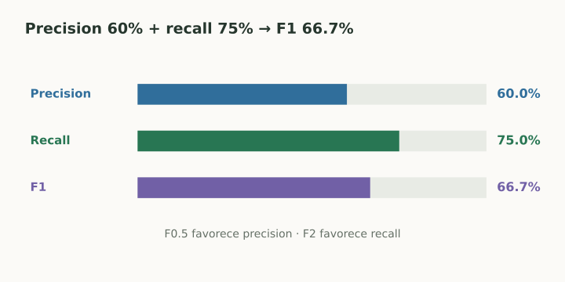

# F1, F-beta y promedios por clase

> **En una frase:** F1 combina precision y recall; los promedios por clase determinan qué casos pesan en el resultado.

## Vista rápida

- F1 combina precision y recall con una media armónica.
- Macro da igual peso a cada clase; weighted usa su frecuencia.

$$
F_1=\frac{2PR}{P+R}=\frac{2TP}{2TP+FP+FN}.
$$

Con $P=0.60$ y $R=0.75$: $F_1\approx0.667$. Es una media armónica: cae si una de las dos métricas es baja. No usa TN.

## F-beta
$$
F_\beta=(1+\beta^2)\frac{PR}{\beta^2P+R}.
$$

$\beta>1$ da más importancia a recall; $\beta<1$ a precision. En el mismo ejemplo, **F2 ≈ 71.4%** y **F0.5 = 62.5%**.

F-beta expresa una preferencia entre métricas; no sustituye un cálculo explícito del costo de errores.

## Cuando hay varias clases
Un router puede elegir ventas, soporte o humano. Calculá cada clase como positiva frente al resto.

| Promedio | Cómo se obtiene | Qué puede esconder |
|---|---|---|
| Macro | Promediar la métrica de cada clase con igual peso | Poco soporte de una clase |
| Weighted | Promediar ponderando por casos reales de cada clase | Fallas de clases raras |
| Micro | Sumar TP, FP y FN antes de calcular | Dominio de clases frecuentes |

Macro-F1 es la media de los F1 por clase, no necesariamente el F1 de macro-precision y macro-recall.

En multiclase de una sola etiqueta, usando todas las clases, micro-F1 coincide con accuracy. En multilabel puede haber varias etiquetas positivas por ejemplo y esa igualdad no se mantiene en general.

## Se conecta con
[[Desbalance y calidad de etiquetas]] · [[Umbrales y costo de errores]] · [[Tool evals]]

## Fuentes
- [scikit-learn · F-beta](https://scikit-learn.org/stable/modules/generated/sklearn.metrics.fbeta_score.html)
- [scikit-learn · classification report](https://scikit-learn.org/stable/modules/generated/sklearn.metrics.classification_report.html)
